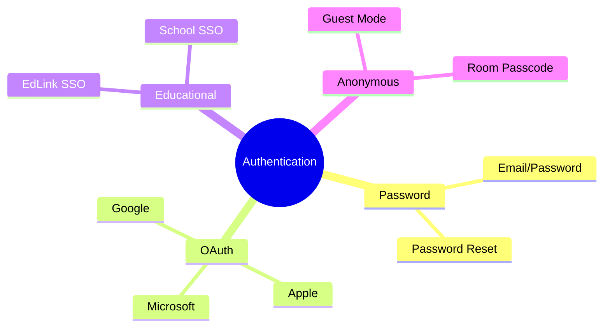
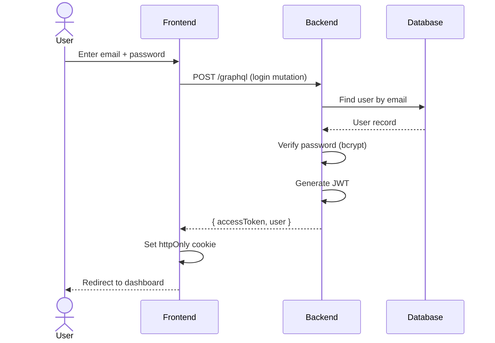
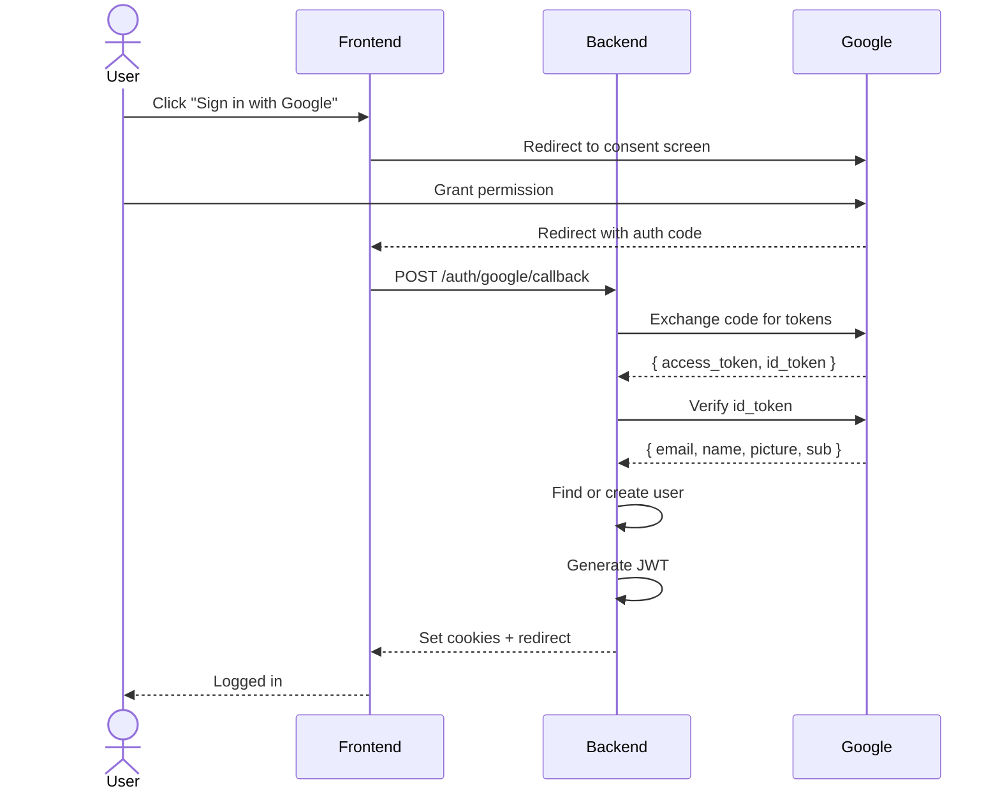
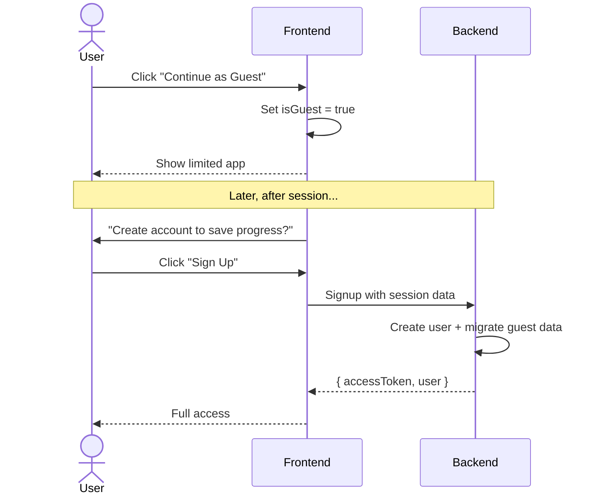
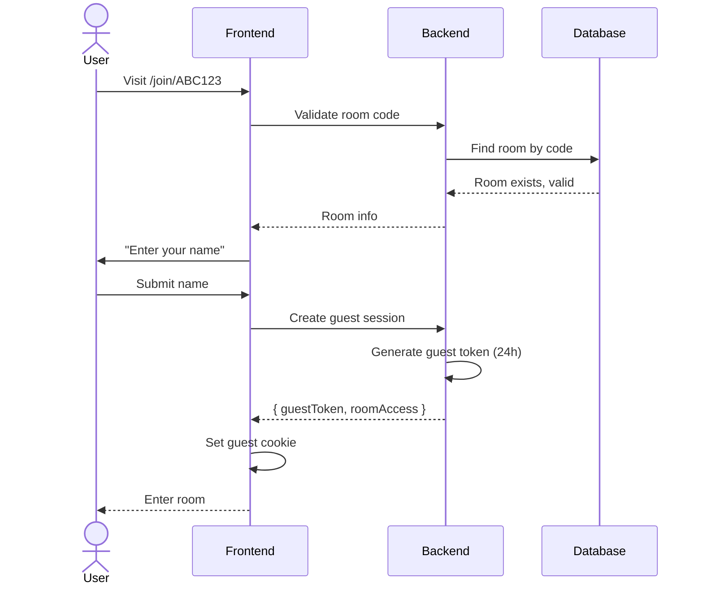
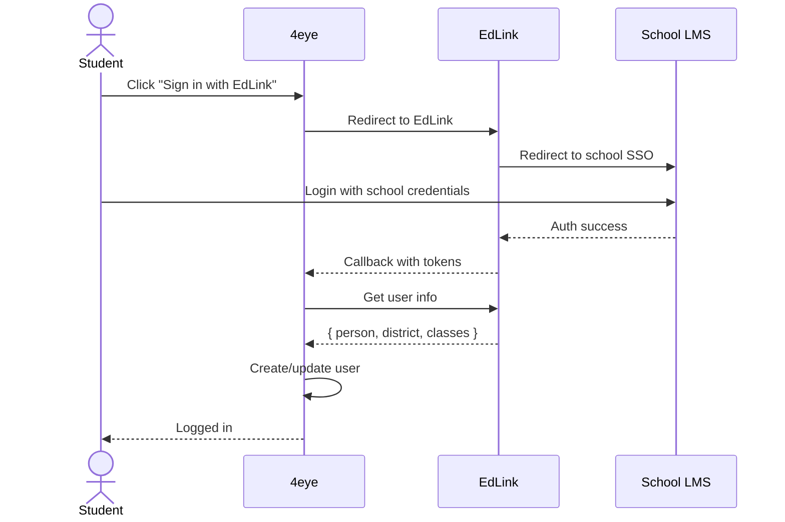
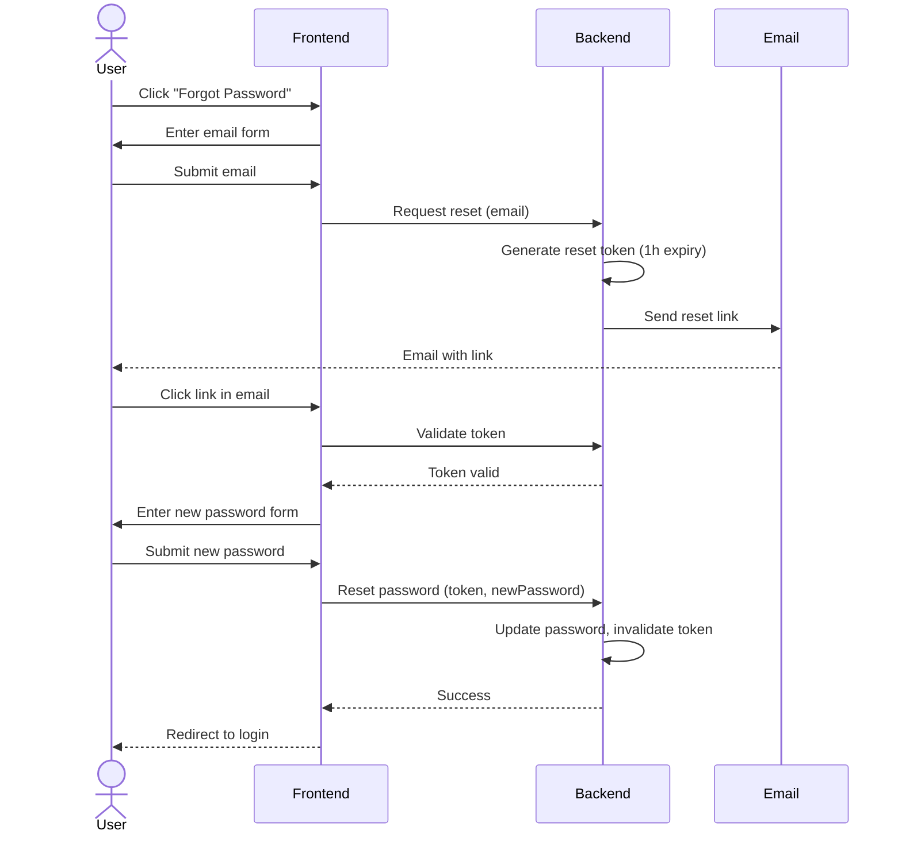

# Authentication Methods

## Overview

4eye/Expanse supports multiple authentication methods to accommodate different user types and compliance requirements.



---

## Method Comparison

| Method | Package | User Type | Consent | COPPA | Priority |
|--------|---------|-----------|---------|-------|----------|
| Email/Password | @expanse/auth | All | Required | Parental | MVP |
| Google OAuth | @expanse/auth | All | Required | Parental | MVP |
| Apple Sign In | @expanse/auth | iOS | Required | Parental | iOS Launch |
| Guest Mode | @expanse/auth | Visitors | Minimal | N/A | MVP |
| Room Passcode | @4eye/features | Session Guest | Minimal | N/A | MVP |
| EdLink SSO | @4eye/auth-edlink | Students/Teachers | School | School-as-Agent | Phase 3 |

---

## 1. Email/Password Authentication

### Flow



### Security Requirements

| Requirement | Implementation |
|-------------|----------------|
| Password hashing | bcrypt (cost factor ≥ 10) |
| Min password length | 8 characters |
| Password complexity | 1 upper, 1 lower, 1 number |
| Rate limiting | 5 attempts / 15 minutes |
| Account lockout | After 10 failed attempts |

### Backend Implementation

```typescript
// apps/api/src/modules/auth/auth.service.ts

async login(email: string, password: string): Promise<AuthPayload> {
  // 1. Find user
  const user = await this.usersService.findByEmail(email);
  if (!user) {
    throw new UnauthorizedException('Invalid credentials');
  }

  // 2. Verify password
  const isValid = await bcrypt.compare(password, user.passwordHash);
  if (!isValid) {
    await this.recordFailedAttempt(email);
    throw new UnauthorizedException('Invalid credentials');
  }

  // 3. Check if within consent
  const hasConsent = await this.consentService.hasRequiredConsent(user.id);
  
  // 4. Generate tokens
  const accessToken = this.generateAccessToken(user);
  const refreshToken = this.generateRefreshToken(user);

  return { accessToken, refreshToken, user, requiresConsent: !hasConsent };
}
```

---

## 2. Google OAuth

### Flow



### Account Linking

When a user signs in with Google:

1. **New user** → Create account with Google data
2. **Existing email** → Link Google to existing account
3. **Already linked** → Login directly

```typescript
async findOrCreateOAuthUser(data: OAuthUserData): Promise<User> {
  // Check if OAuth account already linked
  let user = await this.usersRepo.findOne({
    where: { 
      oauthProvider: data.provider, 
      oauthProviderId: data.providerId 
    },
  });

  if (user) return user;

  // Check if email exists (link accounts)
  user = await this.usersRepo.findOne({ 
    where: { email: data.email } 
  });

  if (user) {
    // Link OAuth to existing account
    user.oauthProvider = data.provider;
    user.oauthProviderId = data.providerId;
    user.emailVerified = true;
    return this.usersRepo.save(user);
  }

  // Create new user
  return this.usersRepo.create({
    email: data.email,
    name: data.name,
    avatarUrl: data.avatarUrl,
    oauthProvider: data.provider,
    oauthProviderId: data.providerId,
    emailVerified: true,
  });
}
```

---

## 3. Guest Mode

### Purpose
Allow users to experience the app without creating an account.

### Capabilities

| Feature | Guest | Authenticated |
|---------|-------|---------------|
| View public rooms | ✅ | ✅ |
| Join session (view only) | ✅ | ✅ |
| Save progress | ❌ | ✅ |
| Create rooms | ❌ | ✅ |
| AI features | Limited | Full |
| History | ❌ | ✅ |

### Flow



---

## 4. Room Passcode (Join-by-Link)

### Purpose
Allow users to join a specific room/session with a simple code, without account.

### Flow



### Security

| Aspect | Implementation |
|--------|----------------|
| Code format | 6-8 alphanumeric |
| Expiration | Configurable (1h - 30d) |
| Max uses | Optional limit |
| IP logging | Audit trail |

---

## 5. EdLink SSO (Education)

### What is EdLink?
EdLink is an education technology SSO platform that provides:
- Single sign-on via school credentials
- Access to LMS data (Canvas, Schoology, etc.)
- Student roster sync
- COPPA compliance (school-as-agent)

### Flow



### COPPA Advantage

With EdLink, the school acts as the "parental agent" for COPPA consent:

```
┌─────────────────────────────────────────────────────────┐
│                    COPPA Consent Flow                    │
├─────────────────────────────────────────────────────────┤
│                                                          │
│   Direct Signup              EdLink (School SSO)         │
│   ──────────────             ──────────────────          │
│                                                          │
│   User enters age            School verified student     │
│        ↓                              ↓                  │
│   If under 13                 School = parental agent    │
│        ↓                              ↓                  │
│   Request parent email        No additional consent      │
│        ↓                              ↓                  │
│   Send verification           Account created            │
│        ↓                              ↓                  │
│   Parent approves             User logged in             │
│        ↓                                                 │
│   Account created                                        │
│                                                          │
└─────────────────────────────────────────────────────────┘
```

---

## 6. Password Reset

### Flow



### Security

| Requirement | Value |
|-------------|-------|
| Token expiry | 1 hour |
| Token usage | Single use |
| Rate limit | 3 requests / hour / email |
| Token format | 64-char random hex |

---

## Authentication Decision Matrix

Use this to determine which auth method to require/show:

```
                        New User?
                       /         \
                     Yes          No
                     /              \
              Has Room Code?    Has Account?
               /      \          /      \
             Yes       No      Yes       No
             /          \       |         \
     Guest Join    Signup   Login    Signup
                    Form    Form      Form
                      |
              Age Under 13?
               /       \
             Yes        No
             /           \
        COPPA Flow   Standard
         (Parent)      Signup
```

---

## Package Structure

```
packages/
├── @expanse/
│   ├── auth/
│   │   ├── session/
│   │   │   ├── SessionContext.ts
│   │   │   ├── WebSessionProvider.tsx
│   │   │   └── MobileSessionProvider.tsx
│   │   ├── providers/
│   │   │   └── AuthProvider.tsx
│   │   ├── components/
│   │   │   ├── LoginForm.tsx
│   │   │   ├── SignupForm.tsx
│   │   │   ├── GoogleLoginButton.tsx
│   │   │   ├── AppleLoginButton.tsx
│   │   │   └── PasswordResetForm.tsx
│   │   ├── guards/
│   │   │   ├── RequireAuth.tsx
│   │   │   ├── RequireGuest.tsx
│   │   │   └── RequireRole.tsx
│   │   ├── hooks/
│   │   │   ├── useAuth.ts
│   │   │   ├── useSession.ts
│   │   │   └── useHasRole.ts
│   │   ├── apollo/
│   │   │   └── authLink.ts (token refresh link)
│   │   └── index.ts
│   │
│   ├── user/ (Profile UI only)
│   │   ├── components/
│   │   │   ├── UserAvatar.tsx
│   │   │   ├── UserMenu.tsx
│   │   │   └── ProfileForm.tsx
│   │   ├── hooks/
│   │   │   └── useUpdateProfile.ts
│   │   └── index.ts
│   │
│   └── consent/
│       ├── providers/
│       │   └── ConsentProvider.tsx
│       ├── components/
│       │   ├── ConsentDialog.tsx
│       │   └── AgeVerification.tsx
│       ├── guards/
│       │   └── RequireConsent.tsx
│       ├── hooks/
│       │   └── useConsent.ts
│       └── index.ts
│
└── @4eye/
    ├── features/
    │   └── auth/
    │       ├── RoomPasscodeJoin.tsx
    │       └── GuestToMemberPrompt.tsx
    │
    └── auth-edlink/ (Future - Phase 3)
        ├── EdLinkProvider.tsx
        ├── EdLinkButton.tsx
        ├── EdLinkStrategy.ts (Passport)
        └── RosterSync.ts
```
