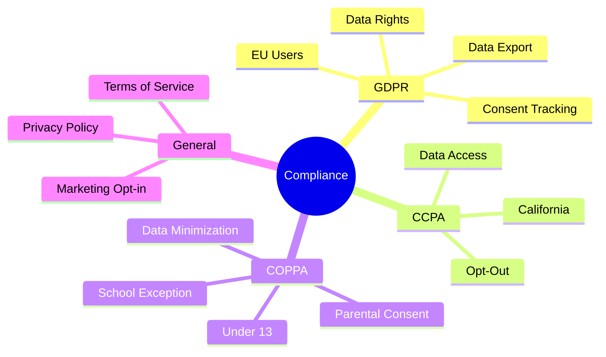
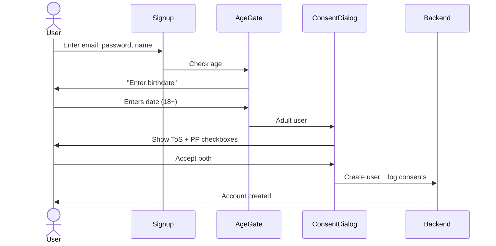
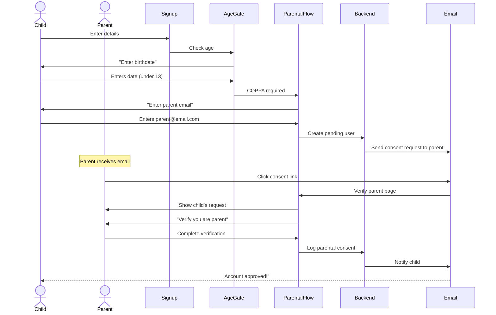
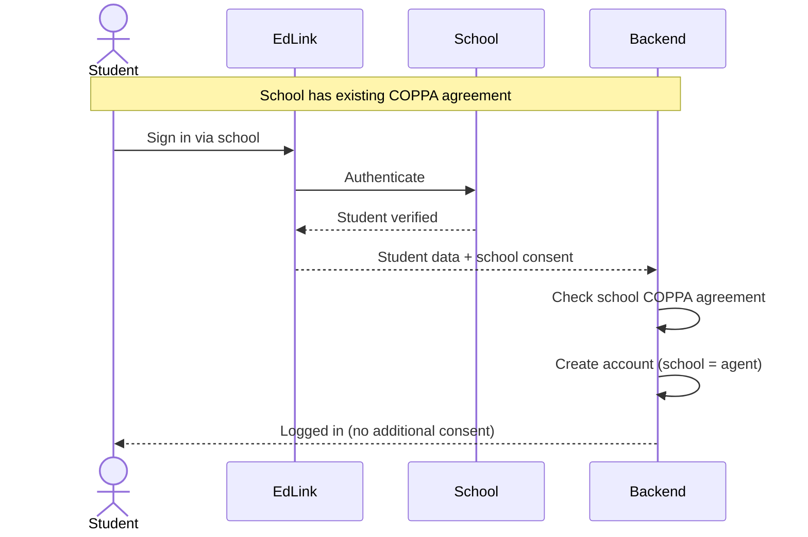

# Consent & Compliance System

## Overview

The consent system tracks user agreements for legal compliance across multiple regulations.



---

## Package Architecture

```
@expanse/consent (Separate Module)
├── providers/
│   └── ConsentProvider.tsx      # Consent state management
├── components/
│   ├── ConsentDialog.tsx        # ToS/PP acceptance UI
│   ├── AgeVerification.tsx      # Age gate component
│   ├── ParentalConsentForm.tsx  # COPPA parent flow
│   └── ConsentHistory.tsx       # View past consents
├── guards/
│   └── RequireConsent.tsx       # Route protection
├── hooks/
│   ├── useConsent.ts            # Main hook
│   └── useConsentHistory.ts     # View history
├── services/
│   └── ConsentService.ts        # API calls
└── types/
    └── consent.types.ts         # Type definitions
```

### Integration with Auth

```
┌─────────────────────────────────────────────────────────────┐
│                    Provider Hierarchy                        │
├─────────────────────────────────────────────────────────────┤
│                                                              │
│   ApplicationProvider                                        │
│   └── SessionProvider (platform-specific: Web or Mobile)     │
│       └── AuthProvider (user state, uses session)            │
│           └── ConsentProvider  ← Checks consent after login  │
│               └── App                                        │
│                                                              │
│   SessionProvider: WebSessionProvider (cookies) or           │
│                    MobileSessionProvider (SecureStore)       │
│   AuthProvider: User state + refresh operations              │
│   ConsentProvider: Blocks if required consents missing       │
│                                                              │
└─────────────────────────────────────────────────────────────┘
```

---

## Consent Types

| Type | Regulation | Required | Re-prompt |
|------|-----------|----------|-----------|
| `TERMS_OF_SERVICE` | All | Yes | On version change |
| `PRIVACY_POLICY` | All | Yes | On version change |
| `MARKETING_EMAIL` | GDPR/CCPA | No | Never (opt-in) |
| `ANALYTICS` | GDPR | Depends | Yearly |
| `PARENTAL_COPPA` | COPPA | If under 13 | Never |

---

## Consent Flow Diagrams

### Standard Signup (Adult)



### COPPA Flow (Under 13)



### School/EdLink Flow (COPPA Exception)



---

## Data Model

### ConsentLog Entity

```typescript
// apps/api/src/modules/consent/entities/consent-log.entity.ts

@Entity()
export class ConsentLog {
  @PrimaryGeneratedColumn('uuid')
  id: string;

  @Column()
  userId: string;

  @ManyToOne(() => User)
  user: User;

  @Column({ type: 'enum', enum: ConsentType })
  type: ConsentType;

  @Column()
  version: string; // "2026-03-27" or "v2.1"

  @Column()
  documentUrl: string; // Link to exact document

  @Column()
  documentHash: string; // SHA-256 of document content

  @CreateDateColumn()
  acceptedAt: Date;

  @Column()
  ipAddress: string;

  @Column()
  userAgent: string;

  @Column({ nullable: true })
  locale: string;

  @Column({ nullable: true })
  consentMethod: string; // 'checkbox', 'signature', 'parental', 'school'
}
```

### ParentalConsent Entity (COPPA)

```typescript
@Entity()
export class ParentalConsent {
  @PrimaryGeneratedColumn('uuid')
  id: string;

  @Column()
  childUserId: string;

  @ManyToOne(() => User)
  childUser: User;

  @Column()
  parentEmail: string;

  @Column()
  verificationToken: string;

  @Column()
  verificationMethod: string; // 'email', 'credit_card', 'id_upload'

  @Column({ nullable: true })
  verifiedAt: Date;

  @Column({ default: false })
  isVerified: boolean;

  @Column()
  expiresAt: Date; // Token expiry (48 hours)

  @CreateDateColumn()
  requestedAt: Date;
}
```

### SchoolConsentAgreement Entity

```typescript
@Entity()
export class SchoolConsentAgreement {
  @PrimaryGeneratedColumn('uuid')
  id: string;

  @Column()
  organizationId: string; // School/district

  @ManyToOne(() => Organization)
  organization: Organization;

  @Column()
  agreementType: string; // 'COPPA', 'FERPA'

  @Column()
  signedBy: string; // Admin name

  @Column()
  signedByEmail: string;

  @Column()
  signedByTitle: string;

  @CreateDateColumn()
  signedAt: Date;

  @Column()
  expiresAt: Date; // Yearly renewal

  @Column()
  documentUrl: string; // Signed agreement PDF

  @Column({ default: true })
  isActive: boolean;
}
```

---

## Consent Provider Implementation

```typescript
// packages/@expanse/consent/src/providers/ConsentProvider.tsx

interface ConsentState {
  hasRequiredConsent: boolean;
  pendingConsents: ConsentType[];
  consentHistory: ConsentLog[];
  isLoading: boolean;
}

interface ConsentContextType extends ConsentState {
  acceptConsent: (type: ConsentType, version: string) => Promise<void>;
  checkConsent: (type: ConsentType, version: string) => Promise<boolean>;
  getConsentHistory: () => Promise<ConsentLog[]>;
  requiresParentalConsent: boolean;
}

export function ConsentProvider({ children }: Props) {
  const { user } = useAuth(); // User state lives in @expanse/auth
  const [state, setState] = useState<ConsentState>({
    hasRequiredConsent: false,
    pendingConsents: [],
    consentHistory: [],
    isLoading: true,
  });

  // Check consent status when user changes
  useEffect(() => {
    if (!user) {
      setState(prev => ({ ...prev, isLoading: false }));
      return;
    }

    checkUserConsent(user.id).then(result => {
      setState({
        hasRequiredConsent: result.hasAll,
        pendingConsents: result.missing,
        consentHistory: result.history,
        isLoading: false,
      });
    });
  }, [user]);

  const acceptConsent = async (type: ConsentType, version: string) => {
    await consentService.logConsent({
      type,
      version,
      documentUrl: getDocumentUrl(type, version),
    });
    
    setState(prev => ({
      ...prev,
      pendingConsents: prev.pendingConsents.filter(t => t !== type),
      hasRequiredConsent: prev.pendingConsents.length <= 1,
    }));
  };

  return (
    <ConsentContext.Provider value={{ ...state, acceptConsent }}>
      {children}
    </ConsentContext.Provider>
  );
}
```

---

## Components

### ConsentDialog

```typescript
// packages/@expanse/consent/src/components/ConsentDialog.tsx

export function ConsentDialog() {
  const { pendingConsents, acceptConsent, hasRequiredConsent } = useConsent();
  const [tosAccepted, setTosAccepted] = useState(false);
  const [ppAccepted, setPpAccepted] = useState(false);

  if (hasRequiredConsent || pendingConsents.length === 0) {
    return null;
  }

  const handleAccept = async () => {
    if (pendingConsents.includes('TERMS_OF_SERVICE') && tosAccepted) {
      await acceptConsent('TERMS_OF_SERVICE', CURRENT_TOS_VERSION);
    }
    if (pendingConsents.includes('PRIVACY_POLICY') && ppAccepted) {
      await acceptConsent('PRIVACY_POLICY', CURRENT_PP_VERSION);
    }
  };

  return (
    <Dialog open fullScreen>
      <DialogTitle>Please Review Our Policies</DialogTitle>
      <DialogContent>
        <FormGroup>
          {pendingConsents.includes('TERMS_OF_SERVICE') && (
            <FormControlLabel
              control={<Checkbox checked={tosAccepted} onChange={e => setTosAccepted(e.target.checked)} />}
              label={<>I accept the <Link href="/terms" target="_blank">Terms of Service</Link></>}
            />
          )}
          {pendingConsents.includes('PRIVACY_POLICY') && (
            <FormControlLabel
              control={<Checkbox checked={ppAccepted} onChange={e => setPpAccepted(e.target.checked)} />}
              label={<>I accept the <Link href="/privacy" target="_blank">Privacy Policy</Link></>}
            />
          )}
        </FormGroup>
      </DialogContent>
      <DialogActions>
        <Button onClick={handleAccept} disabled={!tosAccepted || !ppAccepted}>
          Continue
        </Button>
      </DialogActions>
    </Dialog>
  );
}
```

### AgeVerification

```typescript
// packages/@expanse/consent/src/components/AgeVerification.tsx

export function AgeVerification({ onVerified }: { onVerified: (isMinor: boolean) => void }) {
  const [birthDate, setBirthDate] = useState<Date | null>(null);

  const handleContinue = () => {
    if (!birthDate) return;
    
    const age = calculateAge(birthDate);
    const isUnder13 = age < 13;
    const isUnder18 = age < 18;
    
    onVerified({
      isMinor: isUnder18,
      requiresCoppa: isUnder13,
      age,
    });
  };

  return (
    <Box>
      <Typography>Please enter your date of birth</Typography>
      <Typography variant="caption" color="text.secondary">
        We ask this to provide an age-appropriate experience
      </Typography>
      <DatePicker
        value={birthDate}
        onChange={setBirthDate}
        maxDate={new Date()} // Can't be in future
      />
      <Button onClick={handleContinue} disabled={!birthDate}>
        Continue
      </Button>
    </Box>
  );
}
```

---

## RequireConsent Guard

```typescript
// packages/@expanse/consent/src/guards/RequireConsent.tsx

export function RequireConsent({ children }: { children: ReactNode }) {
  const { hasRequiredConsent, isLoading, pendingConsents } = useConsent();
  const { isAuthenticated, isGuest } = useAuth();

  // Guests don't need full consent
  if (isGuest || !isAuthenticated) {
    return <>{children}</>;
  }

  if (isLoading) {
    return <LoadingSpinner />;
  }

  if (!hasRequiredConsent) {
    return <ConsentDialog />;
  }

  return <>{children}</>;
}
```

---

## Backend API

### GraphQL Schema

```graphql
type ConsentLog {
  id: ID!
  type: ConsentType!
  version: String!
  documentUrl: String!
  acceptedAt: DateTime!
}

enum ConsentType {
  TERMS_OF_SERVICE
  PRIVACY_POLICY
  MARKETING_EMAIL
  ANALYTICS
  PARENTAL_COPPA
}

type ConsentStatus {
  hasAllRequired: Boolean!
  pending: [ConsentType!]!
}

type Query {
  consentStatus: ConsentStatus!
  consentHistory: [ConsentLog!]!
}

type Mutation {
  acceptConsent(type: ConsentType!, version: String!): ConsentLog!
  requestParentalConsent(parentEmail: String!): Boolean!
}
```

---

## Compliance Checklist

### GDPR

- [x] Explicit consent before data collection
- [x] Consent stored with timestamp, IP, version
- [x] Easy consent withdrawal
- [x] Data export capability
- [x] Data deletion ("right to be forgotten")
- [x] Re-consent on document changes

### CCPA

- [x] "Do Not Sell" option
- [x] Data access request capability
- [x] Clear privacy notice
- [x] 12-month consent validity

### COPPA

- [x] Age verification at signup
- [x] Parental consent for under-13
- [x] Verifiable parental consent method
- [x] School-as-agent exception (EdLink)
- [x] Minimal data collection for children
- [x] No behavioral advertising to children
- [x] Parent access to child's data
- [x] Parent can delete child's account
