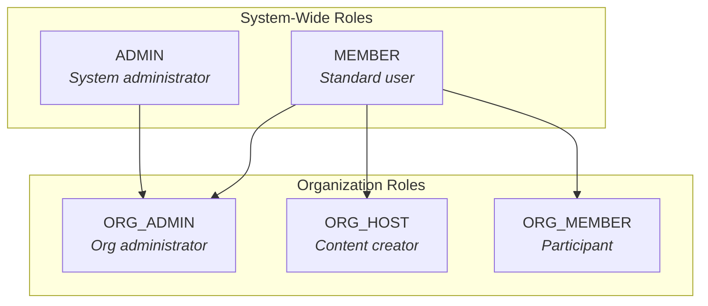
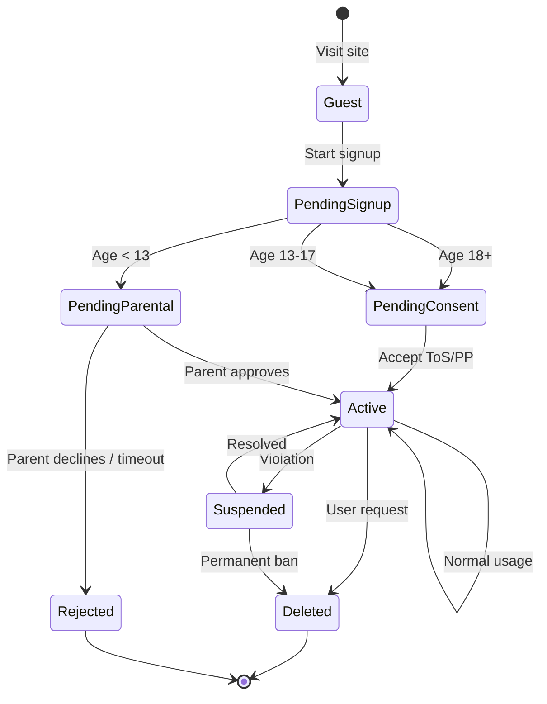

# User Management

## Overview

User management is tightly integrated with authentication but separated for reusability. The `@expanse/user` package handles user data, while `@expanse/auth` handles authentication.

---

## User Entity

```typescript
// apps/api/src/modules/users/entities/user.entity.ts

@Entity()
export class User {
  @PrimaryGeneratedColumn('uuid')
  id: string;

  @Column({ unique: true })
  email: string;

  @Column({ nullable: true })
  passwordHash: string; // Nullable for OAuth-only users

  @Column()
  name: string;

  @Column({ nullable: true })
  avatarUrl: string;

  @Column({ type: 'enum', enum: UserRole, default: UserRole.MEMBER })
  role: UserRole;

  // OAuth fields
  @Column({ nullable: true })
  oauthProvider: string; // 'google', 'apple', 'edlink', null

  @Column({ nullable: true })
  oauthProviderId: string;

  @Column({ default: false })
  emailVerified: boolean;

  // Profile fields
  @Column({ nullable: true })
  preferredLanguage: string;

  @Column({ nullable: true })
  timezone: string;

  // COPPA fields
  @Column({ nullable: true })
  birthDate: Date;

  @Column({ default: false })
  isMinor: boolean;

  @Column({ default: false })
  hasParentalConsent: boolean;

  // Timestamps
  @CreateDateColumn()
  createdAt: Date;

  @UpdateDateColumn()
  updatedAt: Date;

  @DeleteDateColumn()
  deletedAt: Date; // Soft delete
}
```

---

## User Roles

### System-Wide Roles

| Role | Description | Capabilities |
|------|-------------|--------------|
| `MEMBER` | Standard user | Access rooms, view content |
| `ADMIN` | System administrator | Full system access |

### Organization Roles

| Role | Description | Capabilities |
|------|-------------|--------------|
| `MEMBER` | Org member | Attend sessions, view history |
| `HOST` | Content creator | Create rooms, start sessions |
| `ADMIN` | Org admin | Full org control, billing |



---

## User Profile Management

> **Note:** User authentication state (tokens, login, logout) lives in `@expanse/auth` via `useAuth()`.
> The `@expanse/user` package is for **profile UI and updates only**.

### useUpdateProfile Hook

```typescript
// packages/@expanse/user/src/hooks/useUpdateProfile.ts

export function useUpdateProfile() {
  const { user, refetchUser } = useAuth(); // Get user from auth
  const [updateMutation] = useMutation(UPDATE_USER_MUTATION);
  const [isUpdating, setIsUpdating] = useState(false);
  const [error, setError] = useState<Error | null>(null);

  const updateProfile = useCallback(async (data: UpdateProfileInput) => {
    setIsUpdating(true);
    setError(null);
    try {
      await updateMutation({ variables: { input: data } });
      await refetchUser(); // Refresh user data in AuthProvider
    } catch (err) {
      setError(err as Error);
      throw err;
    } finally {
      setIsUpdating(false);
    }
  }, [updateMutation, refetchUser]);

  return { updateProfile, isUpdating, error };
}
```

### Package Purpose

```
@expanse/user (Profile UI Only - NOT auth state)
├── components/
│   ├── UserAvatar.tsx         # Avatar display
│   ├── UserMenu.tsx           # User dropdown
│   └── ProfileForm.tsx        # Edit profile
├── hooks/
│   └── useUpdateProfile.ts    # Profile mutations
└── types/
    └── profile.types.ts       # Profile-specific types
```
```

---

## User Lifecycle



---

## User Operations

### GraphQL Schema

```graphql
type User {
  id: ID!
  email: String!
  name: String!
  avatarUrl: String
  role: UserRole!
  emailVerified: Boolean!
  preferredLanguage: String
  timezone: String
  isMinor: Boolean!
  createdAt: DateTime!
}

enum UserRole {
  MEMBER
  ADMIN
}

type Query {
  me: User
  user(id: ID!): User
}

type Mutation {
  updateUser(input: UpdateUserInput!): User!
  deleteAccount: Boolean!
  requestDataExport: Boolean!
}

input UpdateUserInput {
  name: String
  avatarUrl: String
  preferredLanguage: String
  timezone: String
}
```

### Data Export (GDPR)

```typescript
// apps/api/src/modules/users/users.service.ts

async exportUserData(userId: string): Promise<UserDataExport> {
  const user = await this.findById(userId);
  const consents = await this.consentService.getUserConsents(userId);
  const sessions = await this.sessionsService.getUserSessions(userId);
  const rooms = await this.roomsService.getUserRooms(userId);

  return {
    user: this.sanitizeUser(user),
    consents,
    sessions: sessions.map(this.sanitizeSession),
    rooms: rooms.map(this.sanitizeRoom),
    exportedAt: new Date(),
  };
}
```

### Account Deletion

```typescript
async deleteAccount(userId: string): Promise<void> {
  const user = await this.findById(userId);

  // 1. Revoke all tokens
  await this.authService.revokeAllTokens(userId);

  // 2. Anonymize data (keep for analytics)
  await this.anonymizeUserData(userId);

  // 3. Soft delete user
  await this.usersRepo.softDelete(userId);

  // 4. Send confirmation email
  await this.emailService.sendAccountDeleted(user.email);
}

private async anonymizeUserData(userId: string): Promise<void> {
  await this.usersRepo.update(userId, {
    email: `deleted-${userId}@anonymized.local`,
    name: 'Deleted User',
    avatarUrl: null,
    passwordHash: null,
    oauthProvider: null,
    oauthProviderId: null,
  });
}
```

---

## Frontend Components

### UserAvatar

```typescript
// packages/@expanse/user/src/components/UserAvatar.tsx

export function UserAvatar({ size = 40 }: { size?: number }) {
  const { user } = useAuth(); // User state from @expanse/auth

  if (!user) {
    return <Avatar sx={{ width: size, height: size }} />;
  }

  return (
    <Avatar
      src={user.avatarUrl}
      alt={user.name}
      sx={{ width: size, height: size }}
    >
      {user.name.charAt(0).toUpperCase()}
    </Avatar>
  );
}
```

### UserMenu

```typescript
// packages/@expanse/user/src/components/UserMenu.tsx

export function UserMenu() {
  const { user, logout } = useAuth(); // All from @expanse/auth
  const [anchorEl, setAnchorEl] = useState<HTMLElement | null>(null);

  return (
    <>
      <IconButton onClick={(e) => setAnchorEl(e.currentTarget)}>
        <UserAvatar size={32} />
      </IconButton>
      
      <Menu
        anchorEl={anchorEl}
        open={Boolean(anchorEl)}
        onClose={() => setAnchorEl(null)}
      >
        <MenuItem disabled>
          <Typography variant="body2">{user?.email}</Typography>
        </MenuItem>
        <Divider />
        <MenuItem component={Link} to="/settings">Settings</MenuItem>
        <MenuItem component={Link} to="/settings/privacy">Privacy</MenuItem>
        <Divider />
        <MenuItem onClick={logout}>Logout</MenuItem>
      </Menu>
    </>
  );
}
```

---

## Integration with Auth

```
┌─────────────────────────────────────────────────────────────┐
│                   Integration Flow                           │
├─────────────────────────────────────────────────────────────┤
│                                                              │
│   SessionProvider (WebSessionProvider or MobileSessionProvider)
│   ├── Manages: Token storage (cookies or SecureStore)        │
│   └── Provides: session state for AuthProvider               │
│           │                                                  │
│           ▼                                                  │
│   AuthProvider                                               │
│   ├── Uses: SessionProvider internally                       │
│   ├── Owns: User state (combined with tokens)                │
│   └── Provides: user, login, logout, isAuthenticated         │
│           │                                                  │
│           ▼                                                  │
│   ConsentProvider                                            │
│   ├── Requires: user from AuthProvider                       │
│   ├── Checks: User's consent status                          │
│   └── Provides: pendingConsents, acceptConsent               │
│           │                                                  │
│           ▼                                                  │
│   App                                                        │
│                                                              │
└─────────────────────────────────────────────────────────────┘
```

**Note:** User state lives in `@expanse/auth` via `useAuth()`. The `@expanse/user` package is for profile UI components only.
