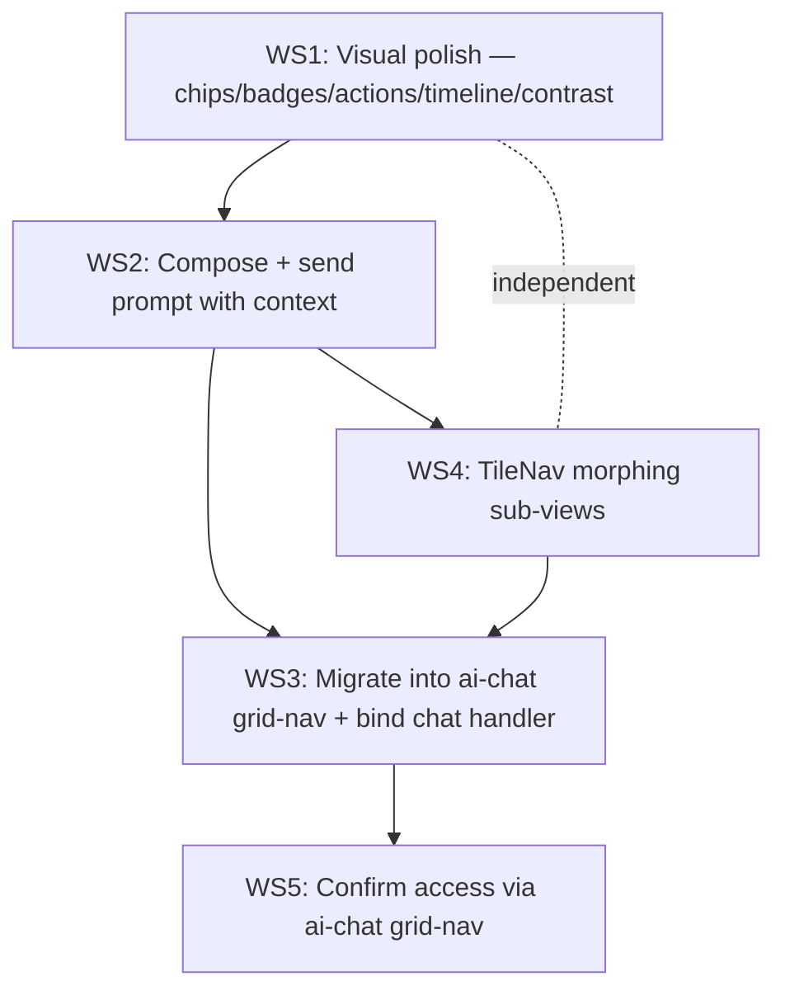

# PLAN — Create Tile Evolution → Unify into 4eye Chat

> **Status:** 📝 draft — pre-implementation review (awaiting approval)
> **Created:** June 2, 2026
> **Owner:** Frontend (4eye/apps/4eye-web-mockup)
> **Lineage:** [marketing-video-sequences.md](./marketing-video-sequences.md) (Seeding → browsable UI) → became the **Create** tile.
> **North Star ref:** [`../_current.md`](../_current.md) §5.1 (entities → Chat UI), §3.1 (resizable panels), §3.2 (morphing on-page nav), §4.1 (single "send to 4eye chat" button).
> **Source component:** `4eye/apps/4eye-web-mockup/src/Tiles/create/`
> **Migration target:** `http://localhost:3311/appRealm/ai-chat`

---

## 0. Decisions captured (locked June 2, 2026)

| # | Question | Decision |
|---|---|---|
| D1 | What does "run prompts" mean? | **Hand the assembled prompt + context to the 4eye chat, which runs it.** No generation backend call from the tile. Reuse existing `useChatInputContext` / `toggleSelect` plumbing. |
| D2 | How does Create live vs. ai-chat? | **Become a grid-nav tile/panel INSIDE ai-chat** (unified in chat) — registered into `AiChatGridNav`, not a standalone route. |
| D3 | Resizable/movable widgets scope | **No resize yet** — preset layouts + collapse toggles only. Honors `_current.md` §4 AI-feedback "defer the heavy panel system." `react-resizable-panels` / `dockview` deferred to a later phase. |
| D4 | Nested tile concept | **§3.2 morphing nav** — a reusable `TileNav`: primary glyph + N sub-icons that expand into a popover. Drives in-tile sub-views. NOT a physical nested (x,y) grid. |
| D5 | Sequencing | **Write this plan first → approve → build.** |

---

## 1. End-state checklist (what "done" looks like)

**Workstream 1 — Visual polish (show more with less space)**
- [ ] `ActionBar` redesigned: denser, clearer hierarchy, primary vs. secondary actions distinguished.
- [ ] `HistoryTimeline` redesigned: tighter rows, better contrast, collapsible "older" group.
- [ ] Badges upgraded: status + medium + weight + depth surfaced as **chips with tooltips** (not bare pills).
- [ ] Contrast pass: replace soft `alpha(...,0.06)` washes with readable, accessible contrast (WCAG AA on text).
- [ ] A shared `InfoChip` primitive (chip + tooltip + glyph) added to `visuals.tsx` and reused everywhere.

**Workstream 2 — Run & send prompts with context**
- [ ] A "compose prompt" affordance in `SceneDetail` that assembles {scene prompt scripts + selected goals + selected Report entities} into one payload.
- [ ] A **"Send to 4eye chat & run"** button that calls the chat hand-off (`toggleSelect` + push prompt into `ChatInputContext`).
- [ ] Multi-select of context items (scene, goals, report entities) before sending — the "specific context" requirement.

**Workstream 3 — Migrate into ai-chat (unified)**
- [ ] Create registered as a tile in `AiChatGridNav` (entity kind: `project`/`animation`).
- [ ] `SendToChatProvider` bound to the real `useContextData().toggleSelect` handler (replacing the window-event fallback).
- [ ] Selecting a scene/goal/report entity in Create reflects in the chat's `selectedContext` + resolved `payload`.
- [ ] Create renders correctly inside the ai-chat provider stack (no duplicate providers).

**Workstream 4 — Nested tile nav (§3.2 morphing nav) + HUD**
- [ ] Reusable `TileNav` component (primary glyph + N sub-icons → morphing popover).
- [ ] Create's internal sub-views (Overview / Scenes / Report / Timeline) driven by `TileNav` instead of always-stacked panels → reclaims vertical space.
- [ ] `TileNav` documented as a reusable concept for other tiles.

**Workstream 5 — Access / mounting**
- [ ] Create reachable inside ai-chat grid-nav (primary, per D2).
- [ ] (Deferred) HUD map position + standalone route — documented, not built.

---

## 2. Workstream 1 — Visual polish (LOW RISK, do first)

> Scope: pure component edits inside `src/Tiles/create/`. No architecture change. No new deps.

### 2.1 Shared `InfoChip` primitive (new, in `visuals.tsx`)
- `InfoChip({ glyph?, label, tooltip, color?, size? })` → MUI `Chip` wrapped in `Tooltip`.
- Variants: status, medium, weight, depth, count.
- Density target: 18–20px height, 11px label, optional leading glyph (14px).
- Replaces ad-hoc inline chips and bare `StatusBadge` usages where a tooltip adds value.

### 2.2 Badges
- `StatusBadge` → keep, but route through `InfoChip` with a tooltip ("Draft · not yet sequenced", etc.).
- Add `MediumChip` (animation/video/image/audio) with glyph + tooltip on the project header.
- `WeightMeter` + `DepthDots` get hover tooltips ("Weight 75 — high alignment", "Depth 3 of 7").

### 2.3 Actions (`ActionBar`)
- Split into **primary** (Generate / Send-to-chat) vs. **secondary** (Toward goal…, Promote) with clear visual weight.
- Tighten to a single dense row; overflow secondary actions into a "more" menu when narrow.
- Add tooltips to every action button (icon-only at narrow widths to save space).

### 2.4 Timeline (`HistoryTimeline`)
- Tighter row rhythm (reduce per-event vertical height ~20%).
- Higher-contrast node colors + connector.
- Collapse events older than N into a "Show N earlier changes" toggle (less space, more on demand).

### 2.5 Contrast pass
- Audit `alpha(..., 0.06)` washes; raise to readable levels or swap to solid `#f5f5f5`/`#fafafa` per Storybook memory.
- Verify text contrast on white meets AA.

### 2.6 Deliverables
| File | Change |
|---|---|
| `components/visuals.tsx` | add `InfoChip`, `MediumChip`; add tooltips to meters/dots |
| `components/ActionBar.tsx` | primary/secondary split + overflow menu + tooltips |
| `components/HistoryTimeline.tsx` | density + contrast + collapse-older |
| `components/SceneDetail.tsx` | adopt new chips/badges, tighten section spacing |
| `Create.stories.tsx` | update/add stories for new chip + dense action/timeline |

---

## 3. Workstream 2 — Run & send prompts with context

> Per **D1**: assemble payload, hand to chat. No backend call here.

### 3.1 Context selection
- Add a lightweight selection model in `CreateProvider` (or local state): `selectedContextIds: { scenes, goals, reportEntities }`.
- Add multi-select affordances (checkbox/active chip) on scene rows, goal cards, and ReportLens rows.

### 3.2 Prompt composer
- A small composer in `SceneDetail`: shows the scene's prompt scripts + chips for each selected context item; editable freetext to prepend instructions.
- "Assemble" produces a `ChatHandoff`-shaped payload: `{ kind:"create:run", prompt, context:[…selected entities] }`.

### 3.3 Send & run
- `SendToChatButton` variant **"Send & run"** → calls the bound chat handler (Workstream 3) which pushes prompt + toggles context, then the chat runs it.
- Until WS3 lands, fall back to the existing `window` CustomEvent so it's testable in Storybook.

### 3.4 Deliverables
| File | Change |
|---|---|
| `store/CreateProvider.tsx` | `selectedContextIds` + toggle actions |
| `components/SceneDetail.tsx` | composer UI + assemble + Send&run |
| `chat/SendToChat.tsx` | `kind:"create:run"` payload + "Send & run" button variant |
| `components/SequenceList.tsx`, `ReportLens.tsx` | multi-select affordances |

---

## 4. Workstream 3 — Migrate into ai-chat (UNIFIED — D2)

> Per **D2**: Create becomes a grid-nav tile/panel inside `/appRealm/ai-chat`.

### 4.1 Bind the chat handler
- In the ai-chat host, wrap Create with `SendToChatProvider handler={...}` that calls `useContextData().toggleSelect(key, id)` and pushes the assembled prompt into `useChatInputContext`.
- Replace the window-event fallback when running inside chat.

### 4.2 Register as a grid-nav tile
- Add a tile entry to `AiChatGridNav` (entity kind `project`/`animation`) that opens Create in the sliding `AiChatViewport` panel.
- Ensure Create does **not** double-wrap providers already supplied by `AiChatProviders` (audit `CreateProvider` vs. `ProjectsProvider`/`ContextDataProvider` overlap; share where possible).

### 4.3 Verify context round-trip
- Selecting scene/goal/report entity in Create → appears in chat `selectedContext` → resolved into `useChatInputContext().payload`.

### 4.4 Deliverables
| File | Change |
|---|---|
| `Tiles/appRealm/aiChat/AiChatDashboard.tsx` (or grid-nav config) | add Create tile entry |
| ai-chat host wiring | bind `SendToChatProvider` to `toggleSelect` + chat input |
| `store/CreateProvider.tsx` | provider-overlap audit (consume shared Projects/ContextData where available) |

---

## 5. Workstream 4 — Nested tile nav (§3.2 morphing nav — D4) + HUD

> Per **D4**: reusable `TileNav` (primary glyph + N sub-icons → morphing popover); drives in-tile sub-views. Reclaims vertical space (replaces always-stacked panels).

### 5.1 `TileNav` component (new, reusable)
- Props: `items: { id, glyph, label, badge? }[]`, `activeId`, `onSelect`, `primaryId`.
- Collapsed: primary glyph + label + small secondary glyphs in a row.
- On click/expand: grid morphs into a **popover** with full labels (framer-motion, already in app).
- Lives where reusable (candidate: a shared `nav/` folder or `@expanse/hud` later; start local in `create/components/`).

### 5.2 Wire into Create
- Replace the always-on stacked left pane (SceneMap + SequenceList + ReportLens) with `TileNav` sub-views: **Overview · Scenes · Report · Timeline** — only the active sub-view renders → more room, less clutter.

### 5.3 HUD integration (light)
- Register Create's `TileNav` items into the HUD where appropriate (e.g., left-rail or center content via existing `useRegisterLeftRailItem` / `useRegisterCenterContent` slots). No new HUD infra.

### 5.4 Deliverables
| File | Change |
|---|---|
| `components/TileNav.tsx` (new) | morphing primary+N nav |
| `CreateTile.tsx` | adopt TileNav for sub-views |
| HUD slot registration (optional) | surface nav in HUD chrome |

---

## 6. Workstream 5 — Access / mounting (D2 primary; rest deferred)

| Access path | Status |
|---|---|
| Grid-nav tile inside `/appRealm/ai-chat` | **Primary (build, WS3)** |
| Standalone route `/appRealm/create` | Deferred (document only) |
| HUD map (x,y) position via `TilePageRouter` | Deferred (document only) |

---

## 7. Explicitly DEFERRED (per D3 + plan §4)

- `react-resizable-panels` / `dockview` / `react-mosaic` — **no resizable/movable/draggable widget manager this phase.**
- Physical nested (x,y) tile-in-tile grid.
- Standalone route + HUD map position (documented, not built).
- Custom right-click "click provider" panels (`_current.md` §1, §4.1) — later.

---

## 8. Execution order (dependency graph)

**Critical path:** WS1 → WS2 → WS3 → WS5. WS4 can run in parallel after WS1.
**Recommended first PR:** WS1 (zero-risk polish), verifiable entirely in Storybook.

---

## 9. Risk register

| Risk | Likelihood | Mitigation |
|---|---|---|
| Provider double-wrap when embedding Create in ai-chat | Med | §4.2 overlap audit; consume shared `ProjectsProvider`/`ContextDataProvider` |
| Chat hand-off payload shape mismatches `useChatInputContext` | Med | Define `ChatHandoff` → `toggleSelect` mapping early; test round-trip in WS3 |
| TileNav morphing animation jank | Low | Reuse framer-motion already in app (AiChat slide-in pattern) |
| Scope creep into resizable panels | Med | D3 locks: defer; this plan explicitly excludes |
| Storybook breakage from heavy imports (see SceneMap history) | Med | Keep new components self-contained; no `@expanse/shell` deep imports |

---

## 10. Review gates (before build kicks off)

1. ☐ Decisions §0 (D1–D5) confirmed correct.
2. ☐ Workstream order (§8) approved — start with WS1.
3. ☐ Agreement that resizable/dockable + standalone route + HUD position are deferred (§7).
4. ☐ Confirm `TileNav` lives local-to-create first (promote to shared later).

Once gates are green: build **WS1** (polish, Storybook-verifiable) → **WS2** → **WS4** ∥ → **WS3** → **WS5**.
