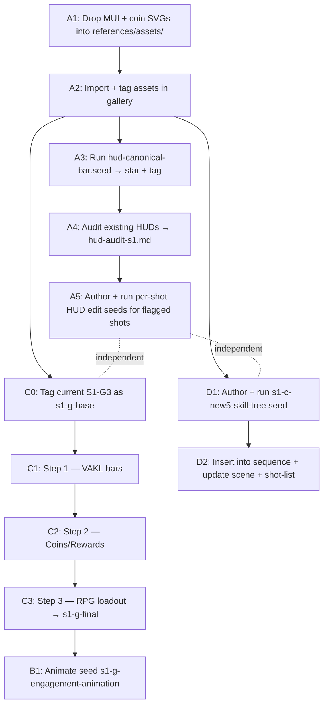

# PLAN — S1 HUD Standardization, S1-G Redesign, and New Skill Tree Shot

> **Status:** � in-progress — seeds authored, awaiting generation runs

---

## VAKL — Learning Modality Definitions

**VAKL** is the four student learning modality model used in the 4eye app (a variant of VARK, replacing Reading/Writing with Logic):

| Letter | Modality | Description | MUI Icon | Bar Fill |
|---|---|---|---|---|
| **V** | **Vision** (Visual) | Student learns through visual stimulus | `Visibility` (outlined) | **75 %** |
| **A** | **Auditory** | Student learns through hearing / listening | `Hearing` (outlined) | **60 %** |
| **K** | **Kinesthetic** | Student learns through physical activity / doing | `PanTool` (outlined) | **50 %** |
| **L** | **Logic** | Student learns through analytical / logical reasoning | `Psychology` (outlined) | **85 %** |

VAKL fill levels are **hard-coded** in all seeds and are not user-configurable at generation time.

---

> **Status:** �📝 draft — pre-implementation review
> **Owner:** Production (marketing-video-see)
> **Source backlog:** [`../project-website-4eye.md`](../project-website-4eye.md) → § "Video Production Tasks & Updates (Gallery App)"
> **Scope:** Six tasks — one cross-cutting (HUD lock), four S1-G refresh, one new shot.
> **Outcome:** Locked canonical HUD across every shot that shows wrong icons today; an "RPG-loadout / VAKL-progress / Coins+Rewards" redesigned S1-G frame; a subtle animation pass over S1-G; a brand-new Skill Tree shot inserted after S1-C-new4.

---

## 0. Decisions captured (from review)

| Decision | Resolution |
|---|---|
| What is "S1-C6"? | Means **after `S1-C-new4` (gift payoff), before `S1-D`**. New shot will be coded **`S1-C-new5`** (a.k.a. `S1-CT` — Skill Tree). |
| HUD icon fidelity | **Literal MUI Material Symbols (Outlined)** glyph shapes — `Visibility`, `Shield`, `Redeem` (gift box w/ ribbon). Recolored to the cyan-amber painted-illustration palette in the prompt. |
| Numbers in i18n stats | **Yes** — numerals are i18n-safe. Coins = **`817`**, Rewards Redeemed = **`12`**. |
| S1-G edit strategy | **3 sequential chained edit seeds** in `seeds/edits/s1-g-refresh/`, tied via **`sceneCode:`** selectors (not tags — `cli asset:tag` does not exist). Each step promotes its output with a unique `--scene-code` so the next seed references it via `sceneCode:S1-G.N`. |
| HUD standardization scope | **Exactly 2 shots flagged:** `S1-C-new1` (Gift icon pre-tap) and `S1-C-new2` (Gift icon tap + energy transfer). N = 2 edit seeds. |
| VAKL fill levels | **75 % / 60 % / 50 % / 85 %** (Vision / Auditory / Kinesthetic / Logic). Hard-coded. |
| VAKL label style | **Pure-glyph only** — no `V A K L` letters. |
| Skill-tree node count | **7 nodes**. |
| `cli asset:tag` | **Does NOT exist.** Chain mechanism switches to `sceneCode:` selectors throughout (§ 4.1 updated). |

---

## 1. End-state checklist (what "done" looks like)

- [ ] One canonical HUD reference asset exists, starred and tagged `hud-canonical`, showing the exact three icons (Eye/Shield/Present) in a 3-button horizontal layout with locked palette.
- [ ] The canonical icon set is documented in `00-style-bible.md` § 7.7 (new).
- [ ] Every shot whose HUD diverges from canonical (per § 2.1 audit) has an edit seed and a re-generated locked keyframe.
- [ ] `S1-G` keyframe replaced by a 3-stage chained edit ending at `S1-G.3-final`:
  - bottom-left: VAKL progress bars
  - bottom-right: Coins (`817`) + Rewards (`12`) icon-only stats
  - bottom-area: RPG-loadout silhouette with 4 MUI gear icons
- [ ] One animate seed produces a clip from `S1-G.3-final` with subtle character motion + UI elements accumulating + MUI icons pulsing with upward chevrons on engagement.
- [ ] A new `S1-C-new5` (Skill Tree) keyframe exists, inserted between `S1-C-new4` and `S1-D` in the sequence and in `shot-list.md`.
- [ ] `scenes/scene-1-classroom.md` updated with new beat for Skill Tree shot.
- [ ] `shot-list.md` updated with new row; cut versions reviewed for 75/30/15/6s duration impact.
- [ ] Brand coin SVG copied into `references/assets/` and visible as an image asset in the gallery (`00_reference/`) tagged `coin-brand`.
- [ ] MUI glyph SVGs (Visibility, Shield, Redeem, Hearing, PanTool, Psychology) copied into `references/assets/` and tagged `mui-glyph:<name>`.

---

## 2. Task A — HUD Standardization (Eye / Shield / Present)

**Goal:** Lock the Teacher HUD spell bar to **three static, unlabeled** MUI-outlined icons in fixed left→right order: **Visibility · Shield · Redeem**. Static = same glyphs, same order, same colors, no labels — across every shot.

### 2.1 HUD audit — RESOLVED

Two shots confirmed as needing HUD standardization:

| Shot | File | Issue | Needs edit? |
|---|---|---|---|
| `S1-C-new1` | `S1-C-new1_gift_icon_pre_tap.png` | HUD button icons differ from canonical | **Yes** |
| `S1-C-new2` | `S1-C-new2_gift_icon_tap_energy_transfer.png` | HUD button icons differ from canonical | **Yes** |

All other keyframes (`S1-A`, `S1-B`, `S1-D`, `S1-D2`, `S1-F`, `S1-G3`, `S1-H`, `S1-I`, `S1-C-new3/4`) — **no HUD edits required**.

N = **2** edit seeds for this task.

### 2.2 New reference assets (manual file drops — no generation)

Add to `marketing-video-see/references/assets/` (new folder):

```
references/assets/
├── mui/
│   ├── visibility-outlined.svg     # https://fonts.google.com/icons -> Visibility (outlined)
│   ├── shield-outlined.svg         # Shield (outlined)
│   ├── redeem-outlined.svg         # Redeem (outlined) -- gift box w/ ribbon
│   ├── hearing-outlined.svg        # for VAKL & RPG loadout
│   ├── pan-tool-outlined.svg       # for VAKL & RPG loadout (Kinesthetic)
│   ├── psychology-outlined.svg     # for VAKL & RPG loadout (Logic)
│   └── arrow-upward-outlined.svg   # for engagement chevron
└── brand/
    └── coin.svg                    # extracted from @expanse/brand-core CoinIcon.tsx
```

**How to source the MUI glyphs:** download direct SVGs from the [Google Fonts Icons](https://fonts.google.com/icons) library (Outlined style, weight 400, fill 0). These are Apache-2.0 licensed — safe to embed as reference inputs.

**How to source the coin:** copy the inline SVG markup from `/Users/mm/Projects/4eye/packages/@expanse/brand-core/src/display/icons/CoinIcon.tsx` and save as a standalone `.svg` with the brand amber/gold fill color baked in.

Once dropped in, run `pnpm cli asset:import` (or whatever the existing import command is — verify in `gallery-app/docs/workflows.md` § "Importing reference assets") and tag them as listed above.

### 2.3 Canonical HUD reference generation

Create **`gallery-app/apps/api/src/seeds/references/hud-canonical-bar.seed.ts`**:

- **Kind:** `generate`
- **Purpose:** Render a single, isolated, transparent-background image of the three-button HUD bar as it should appear in-world. This becomes the **`tag:hud-canonical:starred`** asset used as image-lock for every standardization edit.
- **References:**
  - `sceneCode:MUI-VISIBILITY-OUTLINED` (image)
  - `sceneCode:MUI-SHIELD-OUTLINED` (image)
  - `sceneCode:MUI-REDEEM-OUTLINED` (image)
  - `file:00-style-bible.md` § 7.7 (text — see § 2.5 below)
- **Prompt skeleton:** "Three horizontal floating pill buttons, equally spaced, glowing cyan-amber translucent material, each containing one of the three provided MUI outlined glyphs (Visibility, Shield, Redeem) in identical line weight and identical glow intensity. Order left→right: Visibility, Shield, Redeem. No text, no labels, no numbers. Transparent or neutral dark background. No other UI elements."
- **Promotion:** Once the right variation is generated, run `cli asset:promote <id> --to 00_reference --star --scene-code HUD-CANONICAL` then `cli asset:tag <id> hud-canonical`.

### 2.4 Per-shot standardization edit seeds (only for shots flagged in § 2.1)

For each flagged shot, create **`gallery-app/apps/api/src/seeds/edits/<shot-id>-hud-standardize.seed.ts`**, modeled on the existing `s1-c-old1-v2.seed.ts` pattern (surgical edit-via-generate):

- **References:**
  - `assetId:<source-shot>` role `edit-source` (hard-pinned)
  - `tag:hud-canonical:starred` role `hud-lock`
  - `tag:4eye-reference:starred` role `character-lock` (if 4eye is in frame)
- **Prompt body:** "Replace ONLY the Teacher HUD button bar with the exact three-button layout shown in the provided `hud-lock` reference. Match icon shapes, order (Visibility · Shield · Redeem), spacing, glow, color. Keep everything else identical." (Reuse the KEEP-IDENTICAL block from `s1-c-old1-v2.seed.ts`.)
- **Promotion path:** Output → review → `cli asset:promote --star --scene-code <shot-id>` → `cli seq:replace <slug> <oldId> <newId>` to swap into the canonical sequence.

### 2.5 Style-bible update

Append a new section to `00-style-bible.md`:

```
## § 7.7 Canonical HUD Icon Set (LOCKED)

The Teacher / Student HUD is a horizontal row of exactly THREE floating pill buttons.
Order, left → right:
  1. Visibility   (MUI Material Symbols outlined — open-eye glyph)
  2. Shield       (MUI Material Symbols outlined — shield glyph)
  3. Redeem       (MUI Material Symbols outlined — wrapped-gift-box-with-ribbon glyph)

Rules:
- ALWAYS exactly three buttons. Never more, never fewer.
- ALWAYS in the order above. Never reorder.
- NEVER show text labels next to buttons. Glyphs only.
- Color: cyan-amber duotone glow consistent with shot palette. Glyph stroke = matching cyan, fill = transparent.
- Reference asset: tag:hud-canonical:starred
```

### 2.6 Files & seeds delivered for Task A

| File | Type | Purpose |
|---|---|---|
| `references/assets/mui/*.svg` | static (4 + 1 + 1 + 1 + 1 files) | MUI glyph source + chevron + hearing/pan-tool/psychology for tasks B–D |
| `references/assets/brand/coin.svg` | static | Brand coin for Task D |
| `gallery-app/docs/hud-audit-s1.md` | docs | Audit table — gates seed authoring |
| `00-style-bible.md` § 7.7 | docs | Canonical HUD lock |
| `seeds/references/hud-canonical-bar.seed.ts` | generate | Produces `hud-canonical` asset |
| `seeds/edits/<shot-id>-hud-standardize.seed.ts` × N | generate (edit) | One per flagged shot; N determined by audit |

---

## 3. Task B — S1-G Animation (subtle character motion + UI accumulation)

**Goal:** Single 5–8 s animate clip whose start frame is the final redesigned S1-G keyframe (`S1-G.3-final` produced by Task C). Characters subtly breathe / shift / blink. UI elements (VAKL bars filling, MUI loadout icons pulsing with upward chevrons, coin counter ticking, reward icon flashing) accumulate around them.

### 3.1 Dependency order

This task **must run after Task C completes** because it needs `S1-G.3-final` as the start frame. Document this in the seed file header.

### 3.2 Seed

Create **`gallery-app/apps/api/src/seeds/videos/s1-g-engagement-animation.seed.ts`**:

- **Kind:** `animate` (per architecture facts: animate bypasses SeedRunnerService; uses `AnimateService.startJob()` directly via `cli vid:run`)
- **Provider model:** Veo 3.1 preview (per existing pattern in `s1-a-cold-open.seed.ts`, `s1-b-fly-in.seed.ts`). Note: with `referenceImages` or 1080p, duration auto-clamps to 8 s.
- **startRef:** `sceneCode:S1-G.3-final` (the asset produced by Task C step 3, starred)
- **references[]:** `tag:4eye-reference:starred` as character lock (Veo allows up to 3)
- **aspectRatio:** `16:9` (master) — generate 9:16 reframe in edit
- **Prompt** — describes:
  - **Character motion (subtle):** every visible student does one of {gentle inhale, slow blink, micro head-turn toward HUD, slight shoulder shift}. Teacher's micro-smile deepens 1 frame. No big moves; no walking; camera locked.
  - **UI accumulation timeline (sync to ~6 s clip):**
    - 0.0–1.5 s — VAKL bars (bottom-left) animate in, filling from 0 → current %.
    - 1.5–3.0 s — coin counter (bottom-right) ticks `0 → 817`; small coin-flash particles emit from one student.
    - 3.0–4.5 s — RPG-loadout MUI icons (Visibility, Hearing, PanTool, Psychology) materialize on the character silhouette one at a time, each landing with a soft glow ping.
    - 4.5–6.0 s — on one specific student, an MUI icon pulses and an upward chevron (`arrow-upward-outlined`) floats up 30 px and fades. Reward icon (Redeem) flashes amber once.
  - **Constraints:** No new text. No new characters. Camera locked. No environment shift.

### 3.3 Files & seeds delivered for Task B

| File | Type | Purpose |
|---|---|---|
| `seeds/videos/s1-g-engagement-animation.seed.ts` | animate | Final clip; promoted to `05_videos/` and inserted into sequence |

---

## 4. Task C — S1-G Redesign (3-stage chained edit)

**Goal:** Transform the current `S1-G3` keyframe into a redesigned `S1-G.3-final` by **three sequential surgical edits**, each touching a single region. Chain is readable in code via folder structure, numeric file prefixes, and explicit `step:N/3` tags. Each step's output is promoted with an incrementing scene-code and starred, so the next step references the prior via a step-tag.

### 4.1 Folder & chain structure

> **Note:** `cli asset:tag` does not exist. The chain uses **`sceneCode:` ref selectors** exclusively — each step promotes its output with a unique `--scene-code`, which the next seed references via `sceneCode:S1-G.N`. The `sceneCode:` resolver picks the starred match first when multiple assets share a code (which shouldn't happen here, but `--star` is passed to prevent ambiguity).

```
gallery-app/apps/api/src/seeds/edits/s1-g-refresh/
├── README.md                                # Chain overview, promotion commands, rollback
├── 01-bottom-left-vakl.seed.ts              # Source: sceneCode:S1-G3  (current locked keyframe)
├── 02-bottom-right-coins-rewards.seed.ts    # Source: sceneCode:S1-G.1 (output of step 1)
└── 03-bottom-area-rpg-loadout.seed.ts       # Source: sceneCode:S1-G.2 (output of step 2)  → promotes to sceneCode:S1-G.3-final
```

**Chain promotion ritual (encoded in README.md):**

```bash
# Step 1 — VAKL bars (source: existing S1-G3 keyframe, already has sceneCode=S1-G3)
cli seed:run 01-bottom-left-vakl --variations 2
# Review takes in gallery, pick best
cli asset:promote <chosen-id> --to 03_alternates_and_iterations --scene-code S1-G.1 --star

# Step 2 — Coins/Rewards (source: sceneCode:S1-G.1)
cli seed:run 02-bottom-right-coins-rewards --variations 2
cli asset:promote <chosen-id> --to 03_alternates_and_iterations --scene-code S1-G.2 --star

# Step 3 — RPG loadout (source: sceneCode:S1-G.2) → final keyframe
cli seed:run 03-bottom-area-rpg-loadout --variations 2
cli asset:promote <chosen-id> --to 01_scene_keyframes --scene-code S1-G.3-final --star

# Sequence swap (replace original S1-G3 in the canonical sequence with the final output)
cli seq:replace scene-1-master <old-S1-G3-id> <S1-G.3-final-id>

# Rollback (if needed): re-run step 3 from sceneCode:S1-G.2, or promote an earlier step.
cli seq:replace scene-1-master <S1-G.3-final-id> <old-S1-G3-id>
```

No `cli asset:tag` calls anywhere — only `--scene-code` + `sceneCode:` selectors.

### 4.2 Step 1 — Bottom-Left (VAKL Learning Types)

**Seed:** `01-bottom-left-vakl.seed.ts`

- **Region affected:** Bottom-left ~25 % of frame.
- **Content:** A character-profile / "stat sheet" panel with **four horizontal progress bars**, each labeled by a single MUI glyph only (no letters, no text):
  1. `Visibility` glyph + bar filled to **75 %**
  2. `Hearing` glyph + bar filled to **60 %**
  3. `PanTool` glyph + bar filled to **50 %**
  4. `Psychology` glyph + bar filled to **85 %**
- **Style:** Glowing cyan stroke on a translucent dark-amber panel; bars use the same cyan-amber palette as the HUD; corners feel like an RPG character sheet.
- **References:** edit-source (`sceneCode:S1-G3`), plus image refs `sceneCode:MUI-GLYPHS-VAKL` (composite sheet — all four VAKL glyphs), plus text ref `file:00-style-bible.md` § 7.7.
- **KEEP-IDENTICAL block:** everything except the bottom-left ~25 % region.

> **Resolved (7A):** Fill levels hard-coded: **75 / 60 / 50 / 85** (Vision / Auditory / Kinesthetic / Logic).

### 4.3 Step 2 — Bottom-Right (Coins + Rewards)

**Seed:** `02-bottom-right-coins-rewards.seed.ts`

- **Region affected:** Bottom-right ~25 % of frame.
- **Content:** Two icon-only stat tiles, side by side:
  1. **Coins Gained** — brand `coin.svg` icon + numeral `817` to its right (large, bold, cyan-white).
  2. **Rewards Redeemed** — MUI `Redeem` glyph + numeral `12` to its right.
- **No other text** — no "Coins:" label, no captions.
- **References:** edit-source (`sceneCode:S1-G.1`), image refs `sceneCode:COIN-BRAND`, `sceneCode:MUI-REDEEM-OUTLINED`, text ref `file:00-style-bible.md` § 7.7.
- **KEEP-IDENTICAL block:** everything except the bottom-right ~25 % region (preserve the VAKL panel from Step 1).

> **Resolved (7B):** Rewards count = **12**.

### 4.4 Step 3 — Bottom Area Center (RPG Avatar/Loadout)

**Seed:** `03-bottom-area-rpg-loadout.seed.ts`

- **Region affected:** Bottom-center ~50 % of frame, between the VAKL panel and the Coins/Rewards panel.
- **Content:** A single, simple, glowing **character silhouette** (cyan outline, dark amber fill) representing the focal student. Four MUI glyph icons appear as "gear/stat overlays" on the silhouette:
  - `Visibility` over the head
  - `Hearing` over an ear
  - `PanTool` over a hand
  - `Psychology` over a forehead (slightly above head)
- All icons static in this still (animation pulse + upward chevron happens in Task B's animate clip).
- **No text. No labels. No numbers in this region.**
- **References:** edit-source (`sceneCode:S1-G.2`), image refs `sceneCode:MUI-GLYPHS-VAKL` (composite sheet — all four VAKL glyphs, same as step 1), text ref `file:00-style-bible.md` § 7.7.
- **KEEP-IDENTICAL block:** everything except the bottom-center silhouette region.
- **Final promotion:** Promote to `01_scene_keyframes/` with scene-code `S1-G.3-final` and tag `s1-g-final` — this is the start frame for Task B.

### 4.5 Files & seeds delivered for Task C

| File | Type |
|---|---|
| `seeds/edits/s1-g-refresh/README.md` | docs (chain overview + commands) |
| `seeds/edits/s1-g-refresh/01-bottom-left-vakl.seed.ts` | generate (edit) |
| `seeds/edits/s1-g-refresh/02-bottom-right-coins-rewards.seed.ts` | generate (edit) |
| `seeds/edits/s1-g-refresh/03-bottom-area-rpg-loadout.seed.ts` | generate (edit) |

---

## 5. Task D — New Shot S1-C-new5 (Skill Tree)

**Goal:** A new keyframe inserted **between `S1-C-new4` (gift payoff) and `S1-D`** in the canonical sequence, showing a single student in focus with an expanding UI of circular MUI-icon badge nodes connected by glowing energy lines, with circular progress rings filling/flashing around active nodes.

### 5.1 Scene-file update

Edit `scenes/scene-1-classroom.md` — insert a new beat between Beat 1.4 (HUD Activates) and Beat 1.5 (Students Awaken). Suggested:

```
### Beat 1.4b — Skill Tree Expansion (≈0:10–0:11)
**Action:** Cut to a single student in profile/three-quarter view. UI expands outward
from their head as a constellation of ~7 circular badge nodes, each containing one MUI
outlined glyph (Visibility, Hearing, PanTool, Psychology, Shield, Redeem, Visibility-pulse).
Glowing cyan-amber energy lines connect the nodes into a small web. Two nodes have
circular progress rings around them, filling clockwise from ~30 % to ~75 %, with a flash
at completion. No text.
**Camera:** Slow push-in on the student's face.
**Color:** Hero cyan-amber, slightly brighter ring on active nodes.
**Sound:** Soft synth bloom + a single ringing chime at progress-flash.
**Concepts:** C01, C02, C03, C21
**Shot #:** new shot — `S1-C-new5`
```

**Timeline impact (75s hero):** Adds ~1 s. Either steal from Beat 1.5 (compress to 2 s) or expand total to 76 s. **Recommendation:** steal from Beat 1.5 — Beat 1.4b carries the "engagement signals" promise more clearly than a wider Beat 1.5.

### 5.2 Shot-list update

Edit `shot-list.md`:

- Insert a new row between shots 04 and 05 (new shot #05; existing #05–21 shift to 06–22 OR keep numbering and name it 04b — **recommend** keep numeric ordering, renumber).
- Status: 💡 → 📝 once the prompt is in the seed.
- Re-validate 30 s and 15 s cut versions; the Skill Tree shot is a strong candidate for inclusion in the 15 s cut.

### 5.3 Seed

Create **`gallery-app/apps/api/src/seeds/scenes/s1-c-new5-skill-tree.seed.ts`**:

- **Kind:** `generate`
- **sceneCode:** `S1-C-new5`
- **References:**
  - `tag:4eye-reference:starred` (character-lock) — though 4eye may not be in frame, retain for style consistency
  - `assetId:<S1-C-new4-id>` role `before-anchor` — for character / room continuity from the prior shot
  - `assetId:<S1-D-id>` role `after-anchor` — direction of travel toward the engaged-classroom palette
  - `sceneCode:MUI-GLYPHS-VAKL` (composite sheet — Visibility, Hearing, PanTool, Psychology) + `sceneCode:MUI-GLYPHS-BADGES` (composite sheet — Shield, Redeem, ArrowUpward) — for badge node icons
  - `file:scenes/scene-1-classroom.md` § "Beat 1.4b — Skill Tree Expansion" (text)
  - `file:00-style-bible.md` § 7.7 (text — HUD lock applies to badge icon styling)
- **Prompt** — covers:
  - Composition (single student profile / three-quarter, room visible behind in soft bokeh)
  - Skill tree as a constellation of 7 circular badges connected by glowing lines
  - Two active rings filling, one flashing
  - "NO text, NO labels, NO numbers" negative
  - Aspect 3:2 cinematic widescreen
- **Promotion:**
  ```bash
  cli asset:promote <chosen-id> --to 01_scene_keyframes --scene-code S1-C-new5 --star
  cli seq:insert scene-1-master <chosen-id> --at <position-after-S1-C-new4>
  ```

### 5.4 Files & seeds delivered for Task D

| File | Type |
|---|---|
| `seeds/scenes/s1-c-new5-skill-tree.seed.ts` | generate |
| `scenes/scene-1-classroom.md` (edit) | docs |
| `shot-list.md` (edit) | docs |

---

## 6. Execution order (dependency graph)



**Critical path:** A1 → A2 → C0 → C1 → C2 → C3 → B1. Tasks A5 and D1 can run in parallel with the C-chain once A2 finishes.

---

## 7. Open questions — ALL RESOLVED ✅

| # | Question | Answer |
|---|---|---|
| 7A | VAKL fill levels | Hard-coded **75 / 60 / 50 / 85** (V/A/K/L) |
| 7B | Rewards count | **12** |
| 7C | HUD audit scope | Exactly **2 shots**: `S1-C-new1` and `S1-C-new2` |
| 7D | Skill-tree nodes | **7 nodes** |
| 7E | VAKL label style | **Pure-glyph only** — no letters |
| 7F | `cli asset:tag` exists? | **No.** Chain uses `sceneCode:` selectors exclusively (§ 4.1 updated). |

---

## 8. Risk register

| Risk | Likelihood | Mitigation |
|---|---|---|
| Pro model drifts in "edit-only" mode and touches other regions of the frame | Med | KEEP-IDENTICAL block + run `--variations 2` and select cleanest; fall back to inpaint mask per `s1-c1.5` seed comment block § "Fallback plan" |
| MUI glyph shapes don't survive the painted-illustration restyle | Med | Use literal SVGs as strong image refs; if still drifts, switch to overlay-composite in post (DaVinci) instead of in-prompt |
| Veo 3.1 ignores subtle character-motion direction and over-animates | Med | Pin `durationSeconds` to 6, lower motion strength if provider supports; keep camera locked language explicit |
| New Skill Tree shot blows the 75s budget | Low | Compress Beat 1.5 by 1 s as documented in § 5.1; revisit cut lists |
| Sequence swaps (`seq:replace`) corrupt the canonical sequence if asset IDs are wrong | Low | Run `cli doctor` before and after each swap; commit `library.export.json` after each successful swap for diff-able history |
| `cli asset:tag` may not exist — chain references break | Low | § 7.F clarifies this; fallback uses `--scene-code` selectors instead of tags |

---

## 9. Deliverables summary (one table)

| # | Deliverable | Path | Notes |
|---|---|---|---|
| 1 | MUI glyph SVGs (×7) | `references/assets/mui/` | Apache-2.0, drop from fonts.google.com/icons |
| 2 | Brand coin SVG | `references/assets/brand/coin.svg` | Extracted from `@expanse/brand-core/CoinIcon.tsx` |
| 3 | HUD audit doc | `gallery-app/docs/hud-audit-s1.md` | Gates seed authoring |
| 4 | Style-bible § 7.7 | `00-style-bible.md` | Canonical HUD lock |
| 5 | HUD canonical reference seed | `seeds/references/hud-canonical-bar.seed.ts` | Generates `hud-canonical` asset |
| 6 | Per-shot HUD edit seeds | `seeds/edits/<shot>-hud-standardize.seed.ts` × N | N from § 2.1 audit |
| 7 | S1-G chain README | `seeds/edits/s1-g-refresh/README.md` | Chain commands |
| 8 | S1-G chain seeds (×3) | `seeds/edits/s1-g-refresh/0[1-3]-*.seed.ts` | Sequential, tied via step-tags |
| 9 | S1-G animation seed | `seeds/videos/s1-g-engagement-animation.seed.ts` | Animate kind, Veo 3.1 |
| 10 | New Skill Tree seed | `seeds/scenes/s1-c-new5-skill-tree.seed.ts` | Generate kind |
| 11 | Scene-file beat update | `scenes/scene-1-classroom.md` | New Beat 1.4b |
| 12 | Shot-list row insert | `shot-list.md` | Plus cut-list re-validation |

---

## 10. Review gates (before generation kicks off)

1. ✅ All § 7 open questions answered
2. ✅ § 2.1 HUD audit completed — 2 shots: `S1-C-new1`, `S1-C-new2`
3. ☐ Style-bible § 7.7 reviewed and approved
4. ☐ Scene-file Beat 1.4b copy reviewed
5. ☐ Cut-list 75 / 30 / 15 / 6 s re-validated with new shot
6. ✅ `cli asset:tag` confirmed absent — chain uses `sceneCode:` throughout

Once all six are green, implementation = drop SVGs → write seeds in the order shown in § 6 → run them → review takes → promote → swap into sequence.
