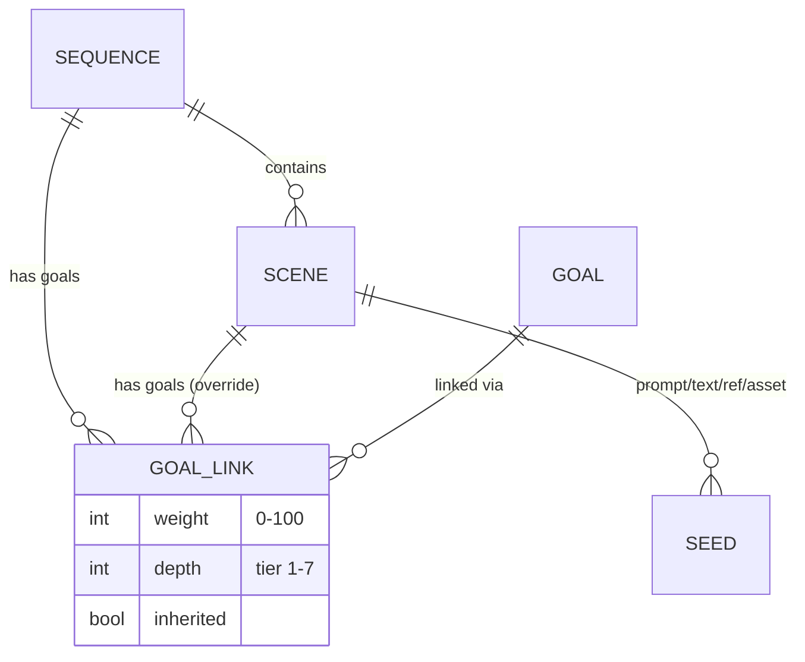
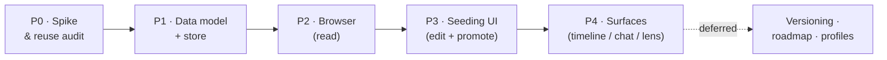

**Status:** Parked for later review — extracted from `_current.md` (June 1, 2026).

> Original ask: *"Along with the concept of promoting to a sequence or to live, let's add another concept of having goals associated with a particular sequence and scene, and have seeding turned into a UI with browsable elements. Save these implementations for later review in a plan file next to marketing-video-see.md."*

---

# Description
Upgrade the animation/video creation flow so that **Sequences** and **Stories** become first-class, browsable, goal-driven entities — not just code-level seeds. This builds on the existing seeding system and the marketing-video pipeline (see [marketing-video-see.md](./marketing-video-see.md)).

# Domain
Animation, Marketing, Video, Entity System

# Targets In Priority
1. Goals associated with Sequences and Scenes
2. Seeding upgraded from code to a browsable UI
3. Sequence/Story unified across Report + Timeline + Command Center views

---

# Core Concepts

## 1. Promote Targets
Existing: promote a scene/animation **to a sequence** or **to live**.
Add: the ability to attach **Goals** (and seed goals) to a particular **Sequence** and **Scene**.

## 2. Goals on Sequences & Scenes
- Each Sequence and Scene can carry one or more **Goals** and **seed goals**.
- Goals guide generation and act as success/quality criteria for the scene.

## 3. Seeding → Browsable UI
- Turn the current code-based seeding system into a **UI with browsable elements**.
- For each scene/animation, surface and edit:
  - Prompt Scripts
  - Goals + seed goals
  - Other text
  - References / assets
- All visible and associated directly with the scene/animation.

## 4. Sequence & Story — What Actually Exists (grounded June 2, 2026)
After reviewing the now-available repos, the "Sequence/Story already exists in Report" belief is **partly true** — there is no literal `Sequence`/`Scene`/`Story` type, but there are **near-equivalents to reuse**:

| Want | Closest existing model | Where |
|---|---|---|
| **Sequence of scenes** | `CommunicationChain` — has `title`, `type`, `dateRange`, and an **ordered `entries[]`** (each = `eventId` + `action` + `perceivedMeaning` + `reality`) | [report/src/data/types.ts](../../../../../../report/src/data/types.ts) |
| **Scene / beat** | `CommunicationChainEntry`, or an `Event` (has `date`, ordering, `relatedEventIds`) | same |
| **Goal weight / depth** | Existing rating fields: `confidenceRating` 1-10, `importanceRating` 1-10, `frequencyScore`, `strength` (weak/moderate/strong) | same |
| **Interpretations / perspectives** | `Perspective` (`type` + `author` + `interpretation` + `likelihood` + `reasoning`) and `SymbolInterpretation` | same |
| **Theories / targets** | `Theory` (`confidenceRating`, `confidenceLevel`, supporting/contradicting IDs) | same |

**Takeaway:** model `Sequence` on `CommunicationChain` (ordered entries) and reuse `Perspective` directly for video-guidance — don't invent these from scratch.

## 5. Two Architectural Tensions To Resolve (grounded)
The two now-available data models **disagree**, and our plan has to pick:

1. **Relationships: embedded arrays vs one edge table.**
   - **Report** uses **embedded ID arrays** (`relatedEventIds`, `peopleIds`, `supportingEventIds`) — simple, but **can't carry edge metadata** like `weight`/`depth`.
   - **`_current.md` + this plan** want **one Relationship edge table** with `meta.{weight,depth}`.
   - → Recommendation: **hybrid** — keep Report's embedded arrays for plain links, but use the **edge table for `Goal↔Scene/Sequence`** specifically, because that's the only link that needs weight/depth. (Confirm — see Questions.)
2. **IDs: string CONST vs UUID.**
   - **Report** = human-readable string IDs (`PERSON_BANKER`). **4eye** ([4eye/docs/planning/plans/core/data-model-overview.md](../../../../../../4eye/docs/planning/plans/core/data-model-overview.md)) = **UUID v4**, camelCase, `createdAt/updatedAt/deletedAt`, `verticalType` + `metadata` JSON.
   - → Recommendation: **UUID primary key + optional `slug`** (keeps 4eye compatibility while preserving Report's readable handles). (Confirm.)

## 6. Viewing Surface
- The **Timeline view in the Command Center** could be a good way to view/browse these sequences and stories (secondary surface; dedicated Seeding screen ships first).

---

# Open Questions
- [x] Reuse the Report/Timeline Sequence-Story model directly, or define a fresh one in the Entity System? (See entity-system notes in `_current.md`.)
  → **High-level concepts reused; field-level values maybe or maybe not.** (Borrow the Sequence/Story *shape*, not necessarily every column.)
- [x] What is the relationship between a Goal and a Scene vs a Goal and a Sequence (inherited / overridable)?
  → **Two primary attributes on the relationship: `weight` and `depth`/`complexity` of target.** Sequence-level goals are inherited by scenes; scene-level entries override the weight/depth.
- [x] Does the seeding UI live in the Command Center timeline, the 4eye chat screens, or both?
  → **Priority is building a dedicated, well-organized Seeding screen** (own route + clean directory). Embedding into the Command Center timeline / 4eye chat is secondary/later. Build the screen first as a standalone, reusable surface.

---

# Visual Overview

**Entity & goal relationships:**



**Build flow (phases):**



> **Smallest first slice to actually see it:** P1 (model) + P2 (read-only browser) using the existing `marketing-video-see` "See" cut as the fixture. That alone makes seeds browsable on screen.

---

# Implementation Plan

> **Goal:** Get sequences, scenes, goals, and seeds created, displayed, and manageable in a **browsable UI** — replacing code-only seeding. Built on the shared Entity model in `_current.md` (composable traits + one Relationship edge table). TS-first.

## Guiding Decisions (carried from `_current.md`)
- **D-S1 — Entities, not bespoke tables.** `Sequence`, `Scene`, `Goal`, `Seed` are all **entity types** in the shared registry (each gets a symbol, permissions, screens).
- **D-S2 — One Relationship edge table.** `Goal↔Scene`, `Goal↔Sequence`, `Scene↔Sequence`, `Asset↔Scene` are all rows in the single edge table; `meta` carries `weight` + `depth`.
- **D-S3 — Reuse Report/Timeline Sequence-Story shape** at the concept level only.
- **D-S4 — Seeds are browsable.** Prompt Scripts, Goals, seed goals, text, references/assets are all editable in-UI, associated directly with the scene/animation.
- **D-S5 — Dedicated Seeding screen first.** Ships as a **new `seeding` Tile** in [`4eye/apps/4eye-web-mockup`](../../../../../../4eye/apps/4eye-web-mockup) (Next.js Tile pattern); timeline/chat embedding comes later.
- **D-S6 — Hybrid relationships.** Embedded ID arrays for plain links; the edge table is used **only** for `Goal↔Scene/Sequence` (carries `weight`/`depth`).
- **D-S7 — IDs = UUID + slug.** UUID primary key (4eye convention) plus a readable `slug` (Report-style handle).
- **D-S8 — Stub store now.** Start against a local in-memory/JSON store; swap to the shared entity store when `_current.md` lands.

## Screen & Directory (priority deliverable)
**Target app: [`4eye/apps/4eye-web-mockup`](../../../../../../4eye/apps/4eye-web-mockup)** — a Next.js app organized into **Tiles** (`src/Tiles/`). The Seeding screen ships as a **new `seeding` Tile**, following the existing `marketing-content` / `projects` Tile pattern. Decision: its own Tile (not nested in `marketing-content`), since it's a distinct workspace, not marketing copy.
```
src/Tiles/seeding/                 ← new Tile (matches existing Tile pattern)
├── SeedingTile.tsx                 ← Tile entry (cf. MarketingContentTile.tsx)
├── components/
│   ├── SequenceList.tsx            ← browsable sequences (sortable by weight)
│   ├── SceneDetail.tsx             ← scene's prompts/goals/seeds/assets
│   ├── GoalLinkRow.tsx             ← weight (0-100) + depth tier control
│   └── SeedInspectorModal.tsx      ← reuses shared Inspector/Focus modal
├── model/                          ← types + goal-inheritance resolver
├── store/                          ← stub store now → swap to shared entity store later
└── content.ts                      ← static copy/config (cf. existing Tiles)
```

## Data Model (draft)

```ts
type EntityType = 'sequence' | 'scene' | 'goal' | 'seed' | 'asset';

// Entity base (shared): UUID id + readable slug (D-S7).
// interface Entity { id: string /*uuid*/; slug?: string; type: EntityType; symbol?: string; meta?: Record<string, unknown>; }

// Sequence mirrors Report's CommunicationChain (ordered entries + title + dateRange).
interface Sequence extends Entity {        // = a "Story", animated
  type: 'sequence';
  status: 'draft' | 'sequence' | 'live';   // promote target (existing concept)
  sceneIds: string[];                       // ordered (cf. CommunicationChain.entries[])
}

interface Scene extends Entity {
  type: 'scene';
  sequenceId: string;
  promptScripts: string[];                  // browsable/editable
  perspectives?: Perspective[];             // REUSE Report's Perspective for video guidance
  status: 'draft' | 'sequence' | 'live';
}

interface Goal extends Entity {
  type: 'goal';
  focusArea?: string;                        // e.g. Engagement, Mental health (Lens)
}

interface Seed extends Entity {              // prompt seed / seed goal / text / ref bundle
  type: 'seed';
  kind: 'prompt' | 'goal' | 'text' | 'reference' | 'asset';
  body: string;
}

// The relationship that answers Open Question #2:
interface GoalLink {                         // a row in the shared Relationship edge table
  fromId: string;  fromType: 'goal';
  toId: string;    toType: 'scene' | 'sequence';
  relationType: 'goal-of';
  meta: {
    weight: number;                          // 0–100
    depth: number;                           // complexity tier (1–7, realistically 3–7 used)
    inherited?: boolean;                     // true when resolved down from a sequence
  };
}
```

**Goal inheritance rule:** a Scene's effective goals = its own `goal-of` links **merged over** its parent Sequence's links (scene `weight`/`depth` override the inherited values). Resolved at read time, not duplicated in storage.

## Architecture (June 2, 2026)

Grounded in the real [`4eye-web-mockup`](../../../../../../4eye/apps/4eye-web-mockup) app (Next.js 14, MUI 9, Storybook 10, Tile pattern). Mirrors the existing **`quests`** module (Provider + Card + types + seed-data) — the closest precedent.

### Layered design
```
┌─ UI (components/) ──────────────────────────────────────────────┐
│  SeedingTile → SequenceList → SceneDetail → GoalLinkRow          │
│                                    └→ SeedInspectorModal         │
└──────────────────────────────────────────────────────────────────┘
            │ reads selectors / dispatches actions
┌─ State (store/SeedingProvider) ─────────────────────────────────┐
│  React Context + useReducer  (per state-mgmt convention)        │
│  selectors: getSequence, getScenes, getEffectiveGoals(sceneId)  │
└──────────────────────────────────────────────────────────────────┘
            │ calls store interface (swappable)
┌─ Data (store/) ─────────────────────────────────────────────────┐
│  SeedStore interface  ──impl──▶  StubStore (in-memory + JSON)   │
│                                  ▶  SharedEntityStore (later)    │
└──────────────────────────────────────────────────────────────────┘
            │ pure logic
┌─ Model (model/) ────────────────────────────────────────────────┐
│  types.ts (Entity base, Sequence, Scene, Goal, Seed, GoalLink)  │
│  resolver.ts (goal-inheritance: scene overrides sequence)       │
└──────────────────────────────────────────────────────────────────┘
```

### State management — **Context + useReducer** (not Redux/zustand)
`SeedingProvider` owns declarative state; UI dispatches actions. Mirrors `QuestsProvider`.
```ts
interface SeedingState { sequences: Sequence[]; scenes: Scene[]; goals: Goal[];
  seeds: Seed[]; goalLinks: GoalLink[]; selectedSequenceId?: string; selectedSceneId?: string }

type SeedingAction =
  | { kind: 'select-sequence'; id: string }
  | { kind: 'select-scene'; id: string }
  | { kind: 'edit-prompt'; sceneId: string; index: number; body: string }
  | { kind: 'link-goal'; goalId: string; toId: string; toType: 'scene'|'sequence'; weight: number; depth: number }
  | { kind: 'unlink-goal'; goalId: string; toId: string }
  | { kind: 'promote'; id: string; to: SeedStatus };
```

### Store interface (the swap seam — D-S8)
The UI/state never import a concrete store; they depend on this interface, so the StubStore → SharedEntityStore swap is a one-line provider change.
```ts
interface SeedStore {
  load(): Promise<SeedingState>;            // hydrate (stub: from JSON fixture)
  save(state: SeedingState): Promise<void>; // stub: no-op / localStorage
}
```

### Goal-inheritance resolver (pure, read-time)
```ts
// effective goals for a scene = sequence links (marked inherited) merged
// under the scene's own links; scene weight/depth override on goalId collision.
getEffectiveGoals(sceneId): ResolvedGoalLink[]
```

### Component responsibilities
| Component | Role | Mirrors |
|---|---|---|
| `SeedingTile` | Tile shell, 2-pane layout, wraps `SeedingProvider` | `MarketingContentTile` |
| `SequenceList` | browsable, sortable-by-weight list of sequences/scenes | `QuestsPanel` |
| `SceneDetail` | prompts + resolved goals + seeds + assets for one scene | `QuestsModal` |
| `GoalLinkCard` | **LinkCard** pattern: compact expandable edge card — collapsed = avatar + title + key badges + `★ weight`; expanded = weight slider, depth tier, free-text `instructions`, and association badges (chips w/ tooltips, optional asset thumbnail) | `QuestCard` |
| `SeedInspectorModal` | full-screen deep-dive (the reusable Inspector) | map dialog |

> **LinkCard pattern** — `GoalLinkCard` is the first instance of a reusable *LinkCard*: a compact, expandable card for any relationship/edge (Asset↔Scene, Scene↔Sequence, Quest↔Goal in planning…). Collapsed it stays a single dense row; expanded it exposes edge metadata + `instructions` + `associations[]` badges. Reuse it for other edges rather than re-inventing per-edge UI.

## Phases

### Phase 0 — Spike & Reuse Audit *(small)* — **partly done June 2**
- [x] Located the real models: **`CommunicationChain` / `Perspective` / `Theory`** in [report/src/data/types.ts](../../../../../../report/src/data/types.ts); **4eye relational conventions** in [4eye/docs/planning/plans/core/data-model-overview.md](../../../../../../4eye/docs/planning/plans/core/data-model-overview.md); 4up erDiagram in [ExpanseFrontend/apps/4up/docs/architecture_diagram.md](../../../../../../ExpanseFrontend/apps/4up/docs/architecture_diagram.md).
- [x] Confirmed there is **no literal Sequence/Scene/Story type** — model `Sequence` on `CommunicationChain`.
- [x] Decided the two tensions in §5 → **hybrid relationships** (edge table only for Goal links) + **UUID `id` + `slug`** (see D-S6/D-S7).
- [ ] Confirm the shared Entity base + Relationship edge table exist or stub them → **stub now** (D-S8); swap later.

### Phase 1 — Data Model & Store
- [ ] Define `Sequence`, `Scene`, `Goal`, `Seed` types + register in the entity registry (symbol, permissions, default screen).
- [ ] Implement `GoalLink` via the shared edge table + the **goal-inheritance resolver** (weight/depth override).
- [ ] Migrate one real existing sequence (e.g. the `marketing-video-see` "See" cut) from code-seeds into the model as the fixture.

### Phase 2 — Sequence / Scene Browser (read)
- [ ] **Sequence list** view (browsable elements, sortable — reuse "sorted by max engagement / weight" pattern).
- [ ] **Scene detail** surface showing associated Prompt Scripts, Goals (with weight/depth), seeds, text, references/assets — the core "seeding as UI" deliverable.
- [ ] Reuse the **Inspector/Focus modal** (from `_current.md`) for full-screen scene deep-dive.

### Phase 3 — Editing & Seeding UI (write)
- [ ] Inline edit of prompt scripts, seed goals, text, reference/asset attachments on a scene.
- [ ] Attach/detach Goals to a Scene or Sequence with `weight` + `depth` controls.
- [ ] **Promote** action: `draft → sequence → live` (wire the existing promote concept to status field).

### Phase 4 — Surfaces & Integration *(after the dedicated screen ships)*
- [ ] Embed the browser into the **Command Center Timeline view** and/or **4eye chat screens** (secondary; screen-first per D-S5).
- [ ] Goal **Lens** filter (Focus Area: Engagement, Mental health, …) over scenes, sorted by weight.
- [ ] Feed selected scene's resolved prompt + goals into the existing generation pipeline (Veo 3 / Sora 2 / Kling).

### Deferred (not now)
- Versioning / Timeline Variants on sequences (metadata association — track later).
- Auto-generated per-sequence roadmap.
- Multi-user / profile association of sequences.

## Open Risks / Decisions Needed
- [x] **Seeding UI home** → **new `seeding` Tile in `4eye-web-mockup`** (resolved June 2).
- [x] **Scales** → `weight` = 0–100; `depth` = complexity tier, 1–7 (realistically 3–7 used).
- [x] **Relationships** → **hybrid**: embedded arrays for plain links, **edge table only for `Goal↔Scene/Sequence`** (the only link needing weight/depth).
- [x] **IDs** → **UUID `id` + readable `slug`** (4eye-compatible + Report-style handles).
- [x] **Build order** → **stub store now**, build the Tile immediately, swap to the shared entity store later (low-risk, identical types).
- [ ] **Confirm** the above four resolutions, then start Phase 1 against the stub store.

---

# Related
- [marketing-video-see.md](./marketing-video-see.md) — marketing video pipeline & scenes (fixture source for Phase 1)
- `_current.md` — Entity System architecture (Sequences/Stories as entity types; shared Relationship table)
- [timeline-roadmap.md](./timeline-roadmap.md) — timeline view (Phase 4 surface)
