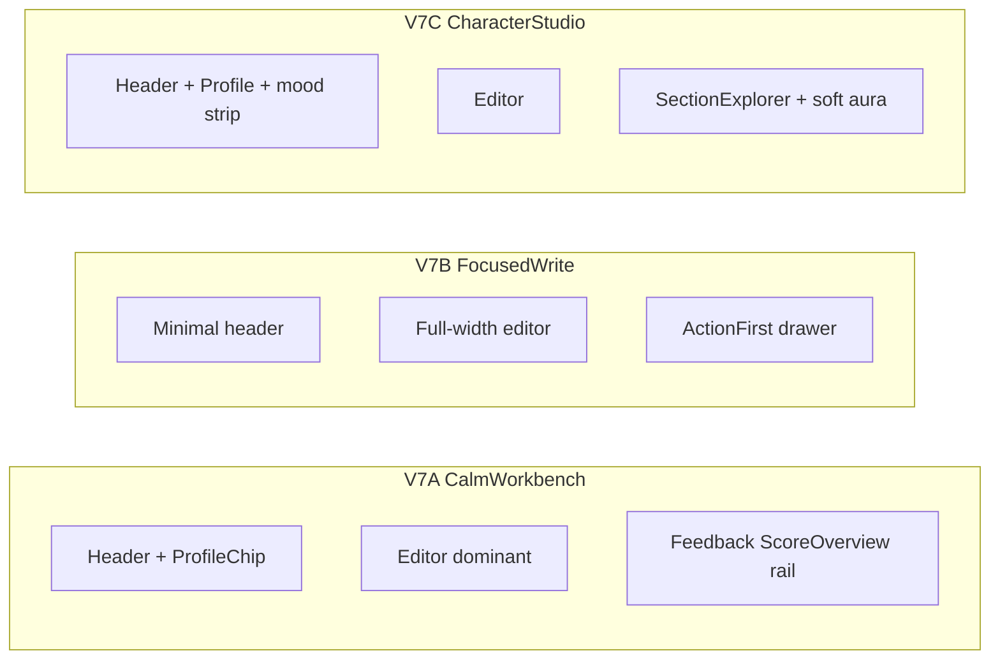

# AIGuidedEditor V7 — UI polish plan

## Goal

Ship **AIGuidedEditorV7** as a visual/UX polish of V6 + FeedbackScreens, not a rewrite of the create flow. Keep V6 untouched. Stay **usable and simple**. Align appearance with **4eye / yen** (deep teal accent `#0c4a39` / `#0f766e`, quiet paper, monospace micro-labels, branch/version chrome language) rather than generic MUI blue/slate.

Adopt the **best FeedbackScreens information architecture** as the default feedback column (lean Action-first or Score overview — decide via the three V7 shell variations below).

## Constraint update (2026-08-11)

**Keep the existing component inventory.** V7 is chrome polish around V6 panels — do not strip:

- Content type **chips**
- Layers pipeline chips / toggles
- Configuration guidelines
- Estimated cost
- **FeedbackPanel** section chips, feedback-options chips, and detail sections
- Variations panel

FeedbackScreens Score / Explorer / Actions are **additional feedback modes** selectable beside Panel (default), not replacements that remove Panel.

## What stays (behavior)

From V6:

- Content type selector, layers pipeline, estimated cost, configuration
- Content editor + variations panel
- Feedback options that affect cost
- `isGenerating` / `isAnalyzing` states

From FeedbackScreens:

- Shared `ContentFeedback`-shaped data (map or adapt from V6 `AIFeedback`)
- One of: Score overview / Section explorer / Action-first as the feedback column (default TBD via variations)

## What changes (appearance + hierarchy)

| Area | V6 today | V7 target |
|------|----------|-----------|
| Color | Cool slate + teal (`lightColors`) | 4eye ink + forest teal; warmer stone borders; score colors unchanged semantically |
| Icons | MUI defaults + emoji in places | Custom glyph set (stroke icons, 16/20px) for sections, layers, intents — no emoji in chrome |
| Density | Tall stacks, heavy cards | One calm surface; fewer nested Paper borders; clearer primary action |
| Feedback | V6 FeedbackPanel (regression vs FeedbackScreens) | Import FeedbackScreens Variation as right rail |
| Identity | None | Compact **user / brand profile** chip (avatar + name + active business) in the header |
| Type | Generic MUI | Slightly stronger title weight; monospace for cost/tokens and version labels |

## Custom icon set (small, intentional)

Add `V7/icons/` with ~12 SVG components (currentColor stroke):

- Goal, Audience, Platform, Tone, Tip, Theme, PainPoint
- Layer, Cost, Generate, Save, Back
- Profile (person-in-circle)

Use them in section chips, header, and empty states. Prefer icons over emoji everywhere in V7 chrome.

## Profile presence (simple)

Header right: `ProfileChip`

- Avatar (initials or image URL prop)
- Display name
- Optional business / brand subtitle
- Click → no modal required in Storybook; `onProfileClick?` stub

This ties the editor to “who is writing” without becoming a settings page.

---

## Three V7 shell variations (Storybook)

Same editor data and FeedbackScreens fixtures. Only **shell chrome + feedback placement + density** differ.



### V7A — Calm Workbench (recommended default)

- Two-column: editor + config left (~58%), feedback ScoreOverview right
- Quiet page background (stone gradient like FeedbackScreens stories)
- Teal primary buttons; outline secondary
- Layers as a compact horizontal strip, not a tall card stack
- ProfileChip in header
- **Feel:** professional create tool, 4eye-adjacent, still simple

### V7B — Focused Write

- Editor full width; configuration collapsed behind one “Setup” disclosure
- Feedback = ActionFirst in a right **drawer** (or bottom sheet on narrow)
- Ratings hidden by default (already ActionFirst behavior)
- ProfileChip muted / smaller
- **Feel:** writing first, AI second — best for “don’t distract me”

### V7C — Character Studio

- Same layout as A, but chrome borrows 4eye profile language:
  - Soft grid background (like ProfilePreview capture band)
  - Accent from profile (`accent` prop, default `#0c4a39`)
  - Tiny “mood / energy” strip under header (static Storybook props — not a real mood system)
  - Feedback = SectionExplorer with custom icons
- **Feel:** closest to 4eye character surface; still readable, not game-UI noise

Storybook title: `Screens/AIGuidedEditorV7` with stories:

- `CompareShells` (A/B/C)
- `V7A_Default`, `V7B_Default`, `V7C_Default`
- `Analyzing`, `Generating` on the chosen default shell

---

## Module layout

```
screens/AIGuidedEditorV7/
  index.ts
  types.ts                 # extends / maps V6 + FeedbackScreens
  theme.ts                 # eyeColors, spacing, radii
  icons/
  components/
    EditorShell.tsx        # shared frame
    ProfileChip.tsx
    SetupDisclosure.tsx    # for V7B
    MoodStrip.tsx          # for V7C only
  shells/
    CalmWorkbench.tsx      # V7A
    FocusedWrite.tsx       # V7B
    CharacterStudio.tsx    # V7C
  AIGuidedEditorV7.stories.tsx
```

Reuse:

- Import FeedbackScreens screens for the feedback column
- Optionally reuse V6 ContentEditor / VariationsPanel / LayersPipeline **visually wrapped** — or thin forks only where chrome must change

Prefer **compose + theme wrap** over copy-paste of V6 logic.

---

## Design tokens (`theme.ts`)

```
ink:        #1c1917
inkMuted:   #78716c
paper:      #fafaf9
paperRaise: #ffffff
border:     #e7e5e4
accent:     #0c4a39      // 4eye profile green
accentSoft: #0f766e      // FeedbackScreens teal
success / warn / error: keep FeedbackScreens semantics
radius:     8–12px
shadow:     single soft elevation, no multi-layer glow
```

Avoid: purple gradients, neon glow, pill clusters, emoji nav.

---

## Implementation order

1. Scaffold V7 theme + icons + ProfileChip
2. Shell A composing V6 pieces + FeedbackScreens ScoreOverview
3. Shell B (Focused Write) + ActionFirst drawer
4. Shell C (Character Studio) + SectionExplorer + MoodStrip
5. Stories: CompareShells + states
6. Capture yen screenshots as **v6 editor shell → v7** when a default is chosen (separate follow-up)

## Acceptance

- V6 unchanged on disk
- Three distinct V7 shells visible in Storybook side-by-side
- Custom icons used in feedback section nav (no emoji in V7 chrome)
- ProfileChip present on A and C; optional/muted on B
- A new user can still: pick type → edit → read feedback → pick variation
- Color/type language reads as 4eye family next to ProfilePreview / yen photos

## Non-goals

- Real auth / live profile API
- Rewriting generation pipelines
- Gamification chrome (coins, XP) in V7
- Dark mode as a primary design
