# 🔐 Secure Ubuntu Setup with Yubikey - Visual Flow Guide

## System Overview

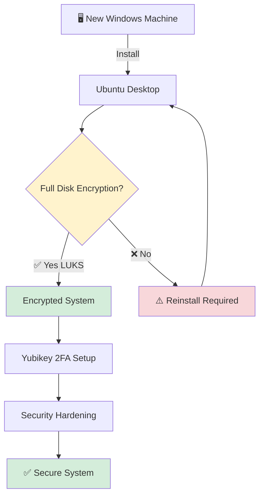

---

## Complete Setup Timeline

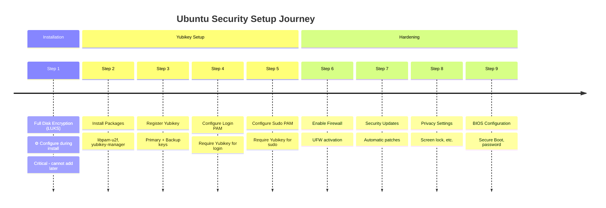

---

## Yubikey Authentication Flow

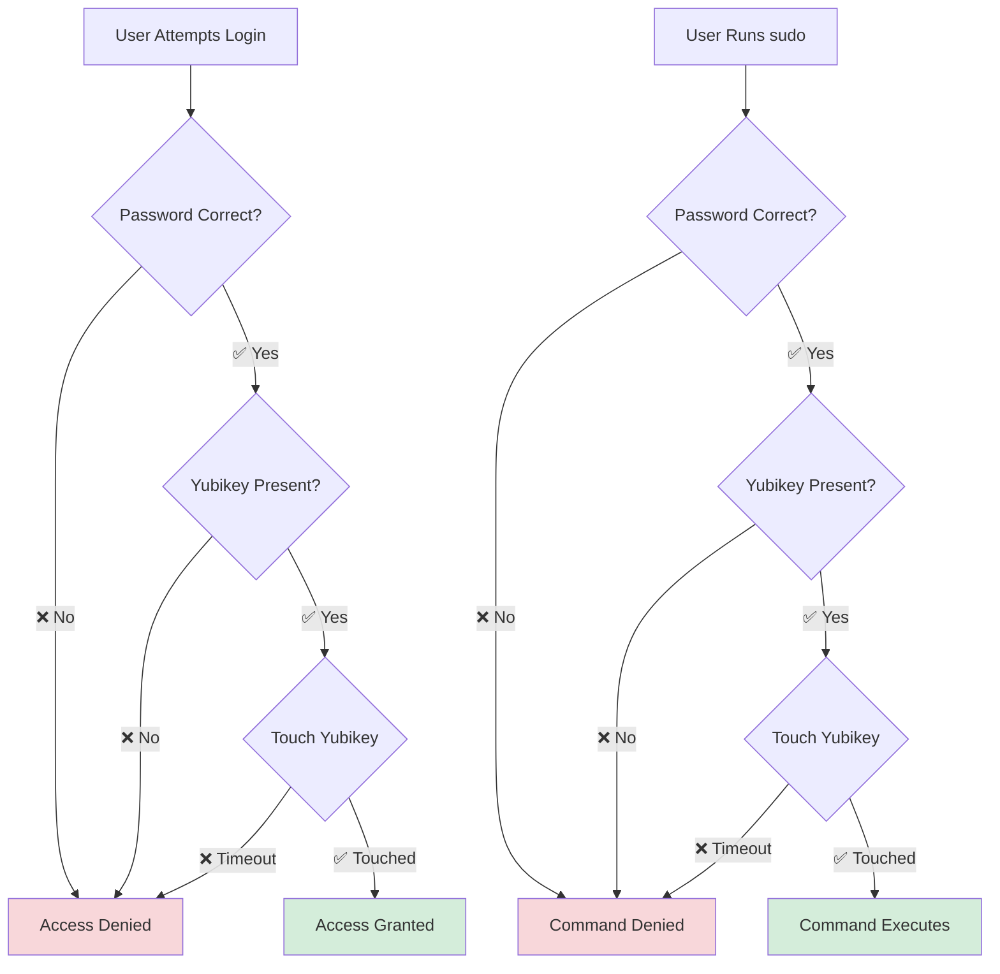

---

## Security Layers

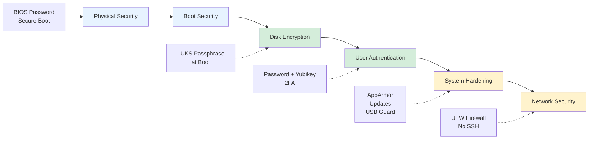

---

## Installation Decision Tree

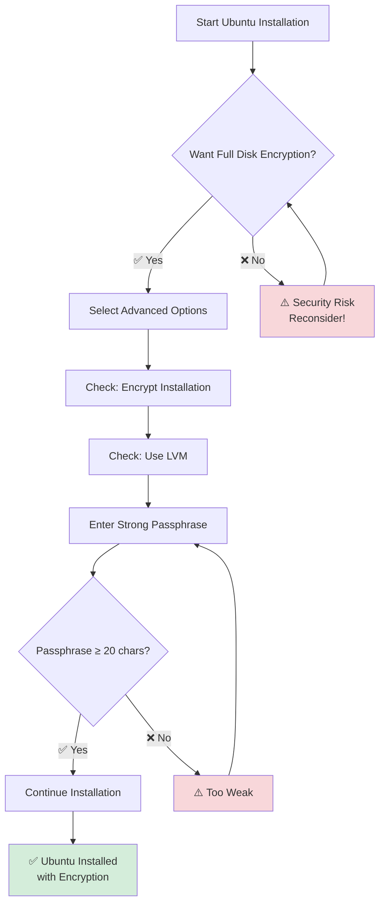

---

## Yubikey Configuration Process

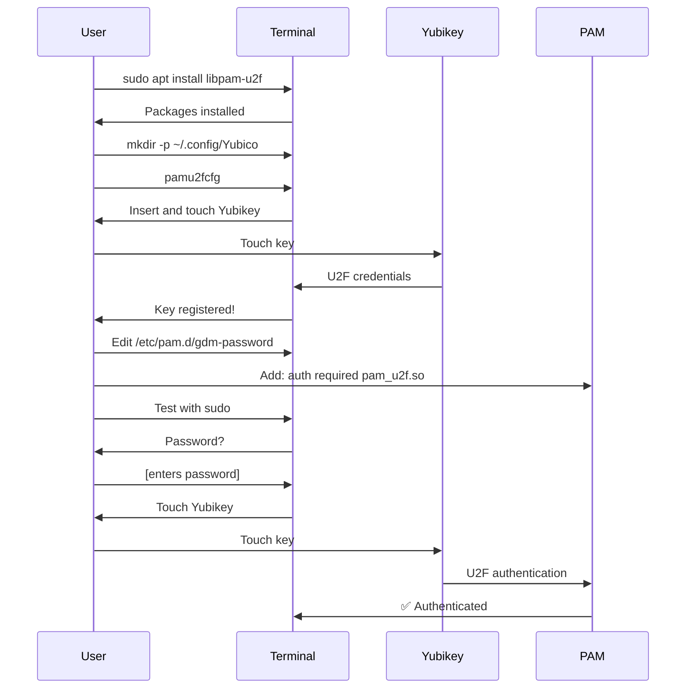

---

## Security Status Matrix

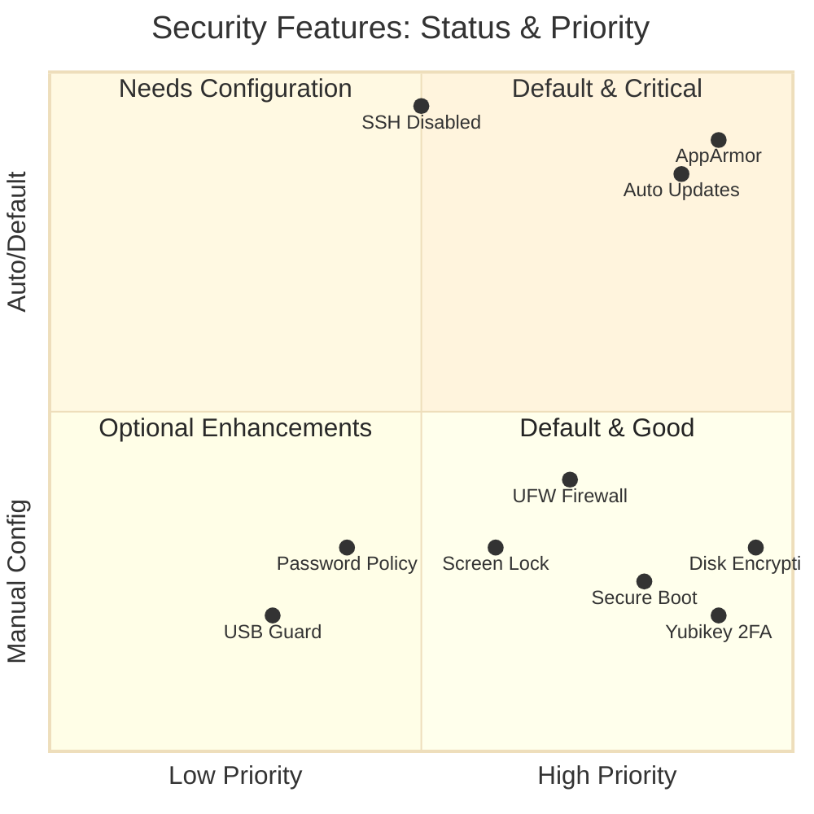

---

## Default vs. Required Configuration

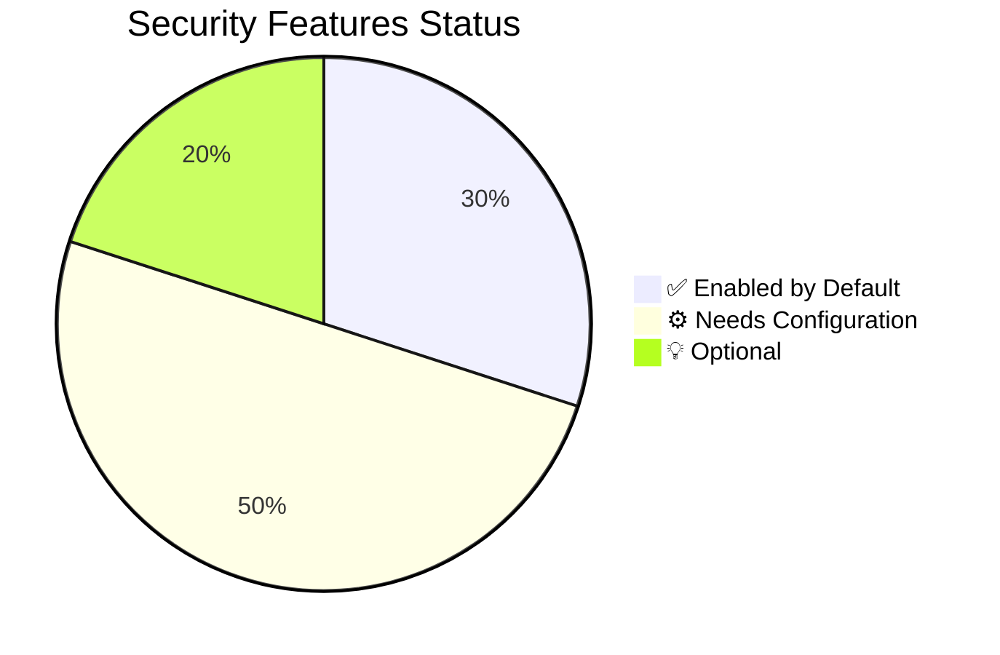

### Legend:
- **✅ Enabled by Default (30%)**: AppArmor, Automatic Updates, SSH Disabled
- **⚙️ Needs Configuration (50%)**: Disk Encryption, Yubikey, Firewall, Secure Boot, Screen Lock
- **💡 Optional (20%)**: USB Guard, Audit Logging, Password Policies

---

## Recovery Plan Flowchart

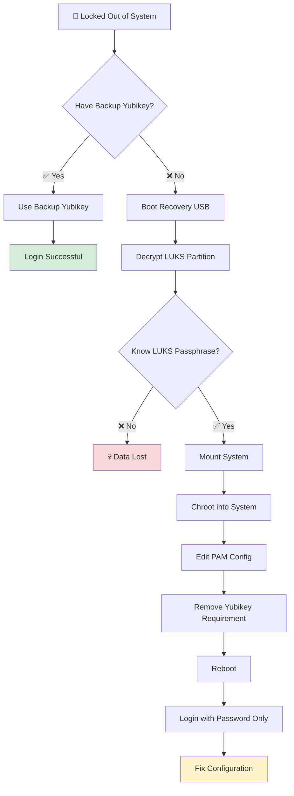

---

## Network Security Architecture

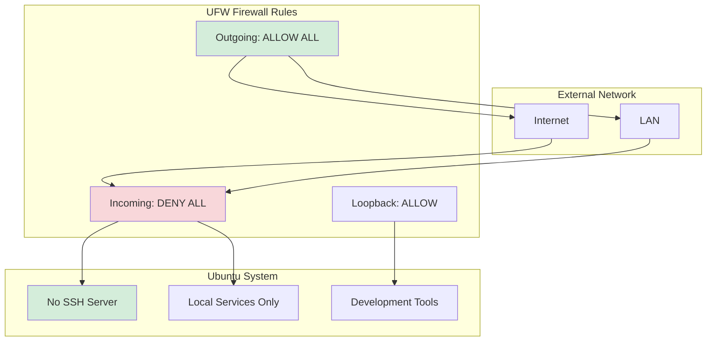

---

## Step-by-Step Setup Sequence

```mermaid
stateDiagram-v2
    [*] --> Fresh_Install
    Fresh_Install --> Installing: Boot Ubuntu ISO
    Installing --> Encryption_Setup: Choose Install Options
    Encryption_Setup --> System_Boot: Complete Installation
    
    state Encryption_Setup {
        [*] --> Enable_Encryption
        Enable_Encryption --> Enable_LVM
        Enable_LVM --> Set_Passphrase
        Set_Passphrase --> [*]
    }
    
    System_Boot --> Package_Install: First Login
    Package_Install --> Yubikey_Config: Install PAM U2F
    
    state Yubikey_Config {
        [*] --> Register_Primary
        Register_Primary --> Register_Backup
        Register_Backup --> Configure_Login
        Configure_Login --> Configure_Sudo
        Configure_Sudo --> Test_Auth
        Test_Auth --> [*]
    }
    
    Yubikey_Config --> Security_Hardening: Yubikey Working
    
    state Security_Hardening {
        [*] --> Enable_Firewall
        Enable_Firewall --> Configure_Updates
        Configure_Updates --> Set_Privacy
        Set_Privacy --> Configure_BIOS
        Configure_BIOS --> [*]
    }
    
    Security_Hardening --> Verification: All Steps Complete
    Verification --> Production_Ready: Tests Passed
    Production_Ready --> [*]
```

---

## Critical Warning Points

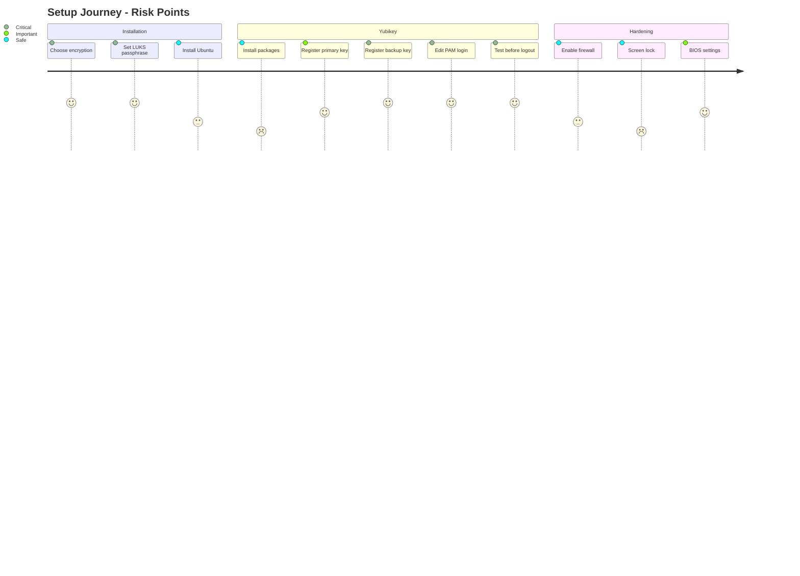

---

## Verification Checklist Flowchart

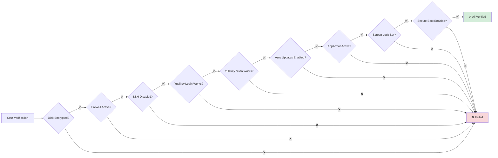

---

## Resource Access Map

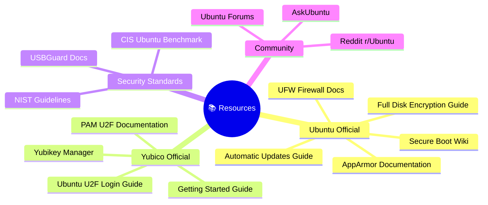

---

## Time Estimation per Phase

```mermaid
gantt
    title Setup Time Estimates
    dateFormat HH:mm
    axisFormat %H:%M
    
    section Installation
    Download Ubuntu ISO       :00:00, 30m
    Create bootable USB       :00:30, 15m
    Install with encryption   :00:45, 45m
    
    section Yubikey
    Install packages          :01:30, 10m
    Register Yubikeys         :01:40, 15m
    Configure PAM             :01:55, 20m
    Test authentication       :02:15, 15m
    
    section Hardening
    Enable firewall           :02:30, 10m
    Configure updates         :02:40, 10m
    Privacy settings          :02:50, 15m
    BIOS configuration        :03:05, 20m
    
    section Verification
    Run tests                 :03:25, 20m
    Final checks              :03:45, 15m
```

**Total estimated time: 2-3 hours**

---

## Priority Actions

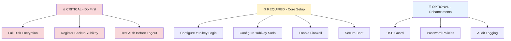

---

## System Boot Process with Security

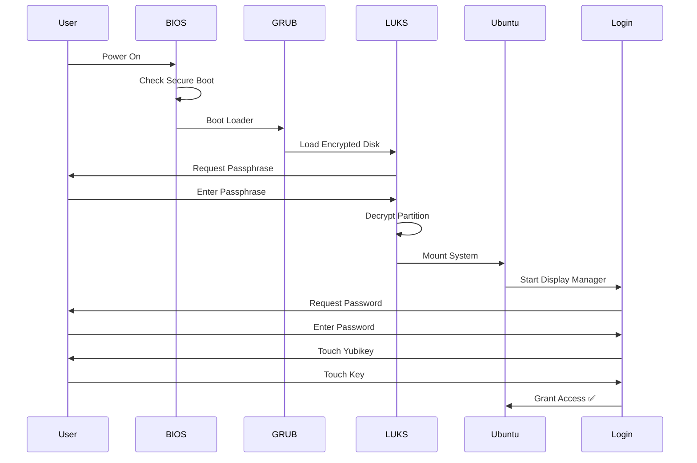

---

## Quick Reference: Commands

### Installation Phase
```bash
# During Ubuntu installation:
# ✅ Check "Encrypt the new Ubuntu installation"
# ✅ Check "Use LVM"
```

### Yubikey Setup
```bash
# Install packages
sudo apt update && sudo apt install libpam-u2f yubikey-manager

# Register Yubikey
mkdir -p ~/.config/Yubico
pamu2fcfg > ~/.config/Yubico/u2f_keys
pamu2fcfg -n >> ~/.config/Yubico/u2f_keys  # backup key
```

### PAM Configuration
```bash
# Login auth
sudo nano /etc/pam.d/gdm-password
# Add: auth    required    pam_u2f.so

# Sudo auth
sudo nano /etc/pam.d/sudo
# Add: auth    required    pam_u2f.so
```

### Firewall
```bash
sudo ufw enable
sudo ufw default deny incoming
sudo ufw default allow outgoing
```

### Verification
```bash
# Check encryption
lsblk -f | grep crypto

# Check firewall
sudo ufw status verbose

# Check SSH
systemctl status ssh

# Check AppArmor
sudo aa-status

# Test Yubikey
sudo -v
```

---

## 🎯 Success Criteria

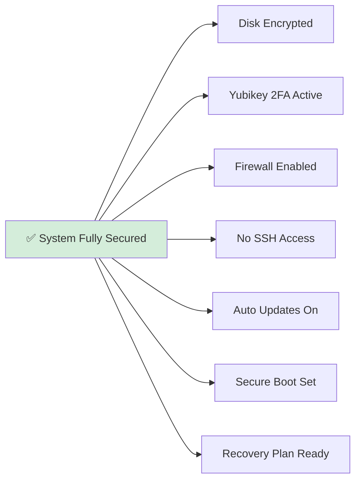

---

*Last Updated: December 2025*  
*Target: Ubuntu 22.04 LTS / 24.04 LTS*  
*Yubikey: 5C NFC*
