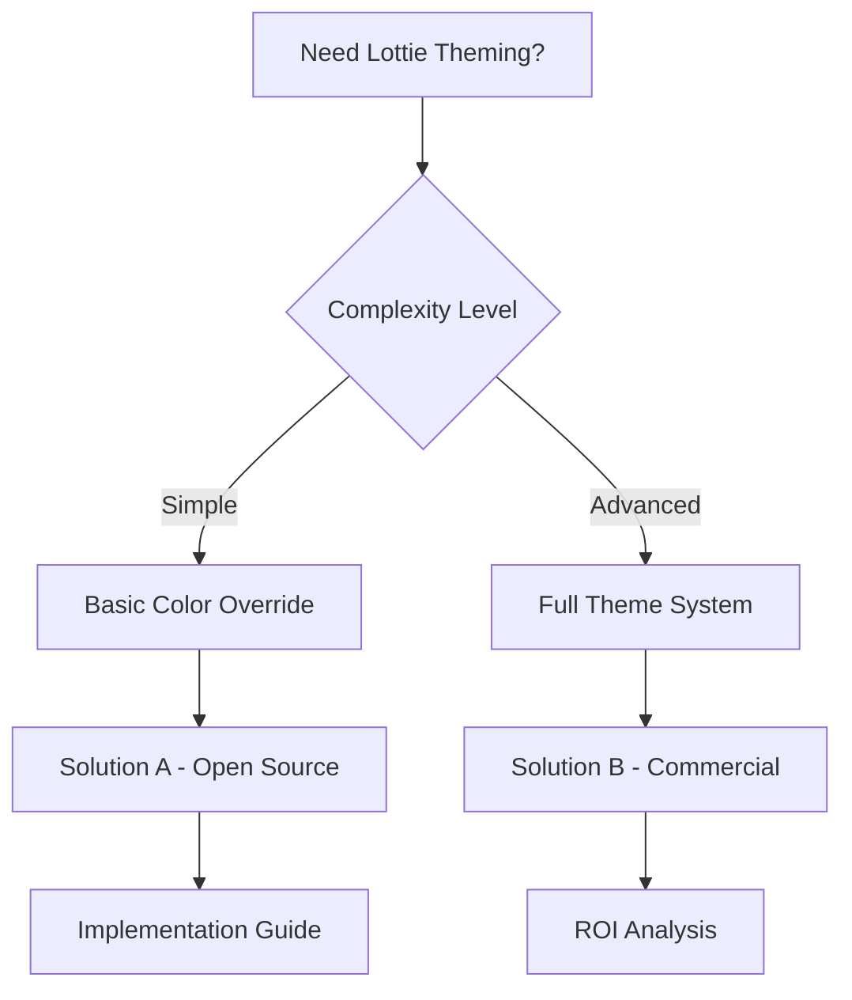

# Research Prompt: Themeable Lottie Animations

## Research Objective

Conduct comprehensive research on existing solutions for creating themeable Lottie animations, with a focus on color theming systems and runtime customization capabilities. Find both open source projects and commercial solutions that enable dynamic color theming of Lottie animations.

## Research Parameters

- **Max Duration**: 2 hours
- **Depth**: Comprehensive - prioritize information quality over speed
- **Scope**: Both open source (fully usable) and paid solutions
- **Focus**: Production-ready tools with active communities

## Key Research Questions

1. **Color Override APIs**: How do solutions handle runtime color changes?
2. **Theme Integration Patterns**: What approaches exist for integrating with design systems?
3. **Configurability**: How flexible are the theming options?
4. **Quality**: What's the visual quality of themed animations?
5. **Performance**: How do solutions impact animation performance?
6. **Browser Support**: What's the compatibility across different browsers?

## Evaluation Criteria

For each solution found, evaluate:

### Open Source Solutions

- **Code Quality**: Architecture, maintainability, test coverage, documentation
- **User Base**: GitHub stars, downloads, active contributors, community health
- **Feature Completeness**: Current capabilities vs stated goals
- **Technology**: Primary stack, dependencies, compatibility with React/Next.js
- **Integration Difficulty**: Setup complexity, API design, learning curve
- **Maintenance Status**: Last update, roadmap, breaking changes, issue resolution
- **Links**: GitHub repo, documentation, demos, examples

### Paid Solutions

- **Cost**: Pricing tiers, free trial limits, TCO estimates
- **Feature Set**: Advanced theming options, enterprise features
- **Support**: Documentation quality, customer support, training
- **Integration**: API quality, SDK availability, deployment options
- **Scalability**: Performance at scale, enterprise features

## Required Output Structure

### 1. Executive Summary (1-3 min read)

```
Top 3 Recommendations:
1. [Tool] - Best for [use case] - [Open Source/Paid/Free tier]
2. [Tool] - Best for [use case] - [Open Source/Paid/Free tier]
3. [Tool] - Best for [use case] - [Open Source/Paid/Free tier]

Decision: BUILD vs BUY vs DOWNLOAD
Reasoning: [2-3 sentences explaining the key factors that led to this decision]
```

### 2. Detailed Overview (5-10 min read)

#### Solution Comparison Table

| Solution     | Type        | Color API | Performance | Browser Support | Learning Curve | Cost     |
| ------------ | ----------- | --------- | ----------- | --------------- | -------------- | -------- |
| [Solution 1] | Open Source | Runtime   | High        | Modern          | Easy           | Free     |
| [Solution 2] | Commercial  | Runtime   | Medium      | All             | Medium         | $X/month |

#### Feature Matrix

| Feature               | Solution A | Solution B | Solution C |
| --------------------- | ---------- | ---------- | ---------- |
| Runtime Color Changes | ✅         | ✅         | ❌         |
| Theme Presets         | ✅         | ❌         | ✅         |
| CSS Integration       | ✅         | ✅         | ❌         |
| TypeScript Support    | ✅         | ✅         | ✅         |

#### Quality Assessment

- **Code Quality**: [Analysis of architecture, maintainability, test coverage]
- **Community Health**: [GitHub activity, contributor count, issue resolution]
- **Documentation**: [Quality of docs, examples, tutorials]
- **Performance**: [Benchmarks, optimization features]

#### Use Case Mapping

- **Simple Color Changes**: [Best solutions for basic theming]
- **Complex Theme Systems**: [Solutions for advanced theming needs]
- **Performance Critical**: [Solutions optimized for speed]
- **Enterprise Scale**: [Solutions for large applications]

### 3. Comprehensive Documentation

#### Open Source Solutions Deep Dive

**Solution 1: [Name]**

- **Repository**: [GitHub link]
- **Stars/Forks**: [Current stats]
- **Last Updated**: [Date]
- **Architecture**: [Technical approach, key components]
- **Setup Guide**: [Step-by-step installation and configuration]
- **Code Quality Analysis**: [Code structure, maintainability, test coverage]
- **Integration Examples**: [Code snippets, React/Next.js integration]
- **Performance Benchmarks**: [Speed tests, memory usage]
- **Known Issues**: [Current limitations, workarounds]
- **Migration Path**: [How to adopt from existing solutions]

**Solution 2: [Name]**
[Same structure as above]

#### Paid Solutions Analysis

**Commercial Solution 1: [Name]**

- **Pricing**: [Detailed pricing breakdown, free tier limits]
- **Feature Comparison**: [vs open source alternatives]
- **ROI Analysis**: [Cost vs development time savings]
- **Support Quality**: [Documentation, customer service, training]
- **Integration Complexity**: [Setup time, learning curve]
- **Scalability**: [Enterprise features, performance at scale]

#### Visual Deliverables

**Decision Flowchart**



**Quality vs Popularity Quadrant**

```
High Quality, High Popularity: [Solutions]
High Quality, Low Popularity: [Solutions]
Low Quality, High Popularity: [Solutions]
Low Quality, Low Popularity: [Solutions]
```

#### Technology Stack Compatibility

| Solution     | React | Next.js | TypeScript | Webpack | Vite |
| ------------ | ----- | ------- | ---------- | ------- | ---- |
| [Solution 1] | ✅    | ✅      | ✅         | ✅      | ✅   |
| [Solution 2] | ✅    | ❌      | ✅         | ✅      | ❌   |

### 4. Implementation Recommendations

#### Quick Start (1-2 hours)

- [Immediate setup steps for fastest implementation]
- [Minimal viable theming solution]

#### Production Ready (1-2 days)

- [Full implementation with best practices]
- [Performance optimization steps]
- [Testing and validation approach]

#### Enterprise Scale (1-2 weeks)

- [Advanced theming system implementation]
- [Integration with design systems]
- [Performance monitoring and optimization]

### 5. Next Steps and Resources

#### Immediate Actions

1. [First step to take after reading this research]
2. [Key resources to explore]
3. [Community channels for support]

#### Learning Resources

- [Documentation links]
- [Tutorial videos]
- [Example projects]
- [Community forums]

#### Development Tools

- [Development setup recommendations]
- [Testing frameworks]
- [Performance monitoring tools]

## Success Criteria

After completing this research, you should be able to answer:

1. **Should I build this myself?** - Clear decision based on available solutions
2. **What's the best open source starting point?** - Specific recommendation with reasoning
3. **What paid tools are worth considering?** - ROI analysis and feature comparison
4. **What's the path of least resistance to production?** - Step-by-step implementation plan

## Research Quality Gates

- **Minimum Solutions**: At least 5 open source projects, 3 commercial options
- **Code Quality Analysis**: Architecture review for top 3 open source solutions
- **Performance Testing**: Benchmarks for recommended solutions
- **Integration Examples**: Working code samples for top recommendations
- **Cost Analysis**: Detailed pricing breakdown for commercial solutions
- **Community Assessment**: Active user base, recent updates, issue resolution

---

_Use this prompt with AI research tools for comprehensive analysis of themeable Lottie animation solutions._
