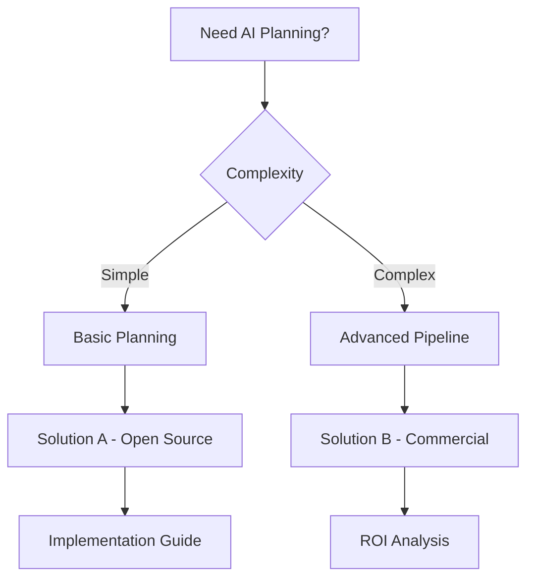

# Research Prompt: AI Planning Pipelines

## Research Objective

Conduct comprehensive research on structured planning tools for AI agents, focusing on task decomposition, dependency management, validation systems, project management integration, AI context improvement, memory and local storage utilization, and AI performance optimization.

## Research Parameters

- **Max Duration**: 2 hours
- **Depth**: Comprehensive - prioritize information quality over speed
- **Scope**: Both open source (fully usable) and paid solutions
- **Focus**: Production-ready tools with active communities

## Key Research Questions

1. **Task Decomposition**: How can complex tasks be broken down into manageable subtasks?
2. **Dependency Management**: What tools exist for managing task dependencies and workflows?
3. **Validation Systems**: How can AI planning outputs be validated and verified?
4. **Project Management Integration**: How do planning tools integrate with existing project management systems?
5. **AI Context Improvement**: What methods exist for enhancing AI context and understanding?
6. **Memory and Storage**: How can AI agents effectively utilize memory and local storage?
7. **Performance Optimization**: What techniques improve AI planning performance?

## Evaluation Criteria

For each solution found, evaluate:

### Open Source Solutions

- **Code Quality**: Architecture, maintainability, test coverage, documentation
- **User Base**: GitHub stars, downloads, active contributors, community health
- **Feature Completeness**: Current capabilities vs stated goals
- **Technology**: Primary stack, dependencies, compatibility with modern frameworks
- **Integration Difficulty**: Setup complexity, API design, learning curve
- **Maintenance Status**: Last update, roadmap, breaking changes, issue resolution
- **Links**: GitHub repo, documentation, demos, examples

### Paid Solutions

- **Cost**: Pricing tiers, free trial limits, TCO estimates
- **Feature Set**: Advanced planning options, AI optimization capabilities
- **Support**: Documentation quality, customer support, training
- **Integration**: API quality, SDK availability, deployment options
- **Scalability**: Performance at scale, enterprise features

## Required Output Structure

### 1. Executive Summary (1-3 min read)

```
Top 3 Recommendations:
1. [Tool] - Best for [use case] - [Open Source/Paid/Free tier]
2. [Tool] - Best for [use case] - [Open Source/Paid/Free tier]
3. [Tool] - Best for [use case] - [Open Source/Paid/Free tier]

Decision: BUILD vs BUY vs DOWNLOAD
Reasoning: [2-3 sentences explaining the key factors that led to this decision]
```

### 2. Detailed Overview (5-10 min read)

#### Solution Comparison Table

| Solution     | Type        | Task Decomp | Dependencies | Validation | Performance | Cost     |
| ------------ | ----------- | ----------- | ------------ | ---------- | ----------- | -------- |
| [Solution 1] | Open Source | ✅          | ✅           | ✅         | High        | Free     |
| [Solution 2] | Commercial  | ✅          | ✅           | ✅         | Medium      | $X/month |

#### Feature Matrix

| Feature                | Solution A | Solution B | Solution C |
| ---------------------- | ---------- | ---------- | ---------- |
| Task Decomposition     | ✅         | ✅         | ❌         |
| Dependency Management  | ✅         | ❌         | ✅         |
| AI Context Enhancement | ❌         | ✅         | ✅         |
| Memory Optimization    | ✅         | ✅         | ❌         |

#### Quality Assessment

- **Planning Quality**: [Analysis of planning capabilities, accuracy, reliability]
- **AI Integration**: [How well tools work with AI agents, context management]
- **Performance**: [Planning speed, resource usage, scalability]
- **User Experience**: [Interface quality, workflow efficiency, learning curve]

#### Use Case Mapping

- **Simple Planning**: [Best solutions for basic task planning]
- **Complex Projects**: [Tools for large-scale project planning]
- **AI Agent Integration**: [Solutions optimized for AI agent workflows]
- **Enterprise Planning**: [Advanced planning for enterprise environments]

### 3. Comprehensive Documentation

#### Open Source Solutions Deep Dive

**Solution 1: [Name]**

- **Repository**: [GitHub link]
- **Stars/Forks**: [Current stats]
- **Last Updated**: [Date]
- **Architecture**: [Technical approach, AI integration, key components]
- **Setup Guide**: [Step-by-step installation and configuration]
- **Code Quality Analysis**: [Code structure, maintainability, test coverage]
- **Planning Examples**: [Sample plans, task breakdowns, workflows]
- **Performance Benchmarks**: [Planning speed, resource requirements]
- **Known Issues**: [Current limitations, workarounds]
- **Migration Path**: [How to adopt from existing solutions]

**Solution 2: [Name]**
[Same structure as above]

#### Paid Solutions Analysis

**Commercial Solution 1: [Name]**

- **Pricing**: [Detailed pricing breakdown, free tier limits]
- **Feature Comparison**: [vs open source alternatives]
- **ROI Analysis**: [Cost vs development time savings]
- **Support Quality**: [Documentation, customer service, training]
- **Integration Complexity**: [Setup time, learning curve]
- **Scalability**: [Enterprise features, performance at scale]

#### Visual Deliverables

**Decision Flowchart**



**Performance vs Features Matrix**

```
High Performance, High Features: [Solutions]
High Performance, Low Features: [Solutions]
Low Performance, High Features: [Solutions]
Low Performance, Low Features: [Solutions]
```

#### Technology Stack Compatibility

| Solution     | Python | Node.js | AI Models | Memory   | Storage     |
| ------------ | ------ | ------- | --------- | -------- | ----------- |
| [Solution 1] | ✅     | ✅      | Multiple  | Advanced | Local/Cloud |
| [Solution 2] | ✅     | ❌      | Limited   | Basic    | Cloud Only  |

### 4. Implementation Recommendations

#### Quick Start (1-2 hours)

- [Immediate setup steps for fastest implementation]
- [Basic AI planning workflow]

#### Production Ready (1-2 days)

- [Full implementation with best practices]
- [Advanced planning configuration]
- [Testing and validation approach]

#### Enterprise Scale (1-2 weeks)

- [Advanced AI planning platform implementation]
- [Integration with existing AI systems]
- [Performance monitoring and optimization]

### 5. Next Steps and Resources

#### Immediate Actions

1. [First step to take after reading this research]
2. [Key resources to explore]
3. [Community channels for support]

#### Learning Resources

- [Documentation links]
- [Tutorial videos]
- [Example planning workflows]
- [Community forums]

#### Development Tools

- [Development setup recommendations]
- [Testing frameworks]
- [Performance monitoring tools]

## Success Criteria

After completing this research, you should be able to answer:

1. **Should I build this myself?** - Clear decision based on available solutions
2. **What's the best open source starting point?** - Specific recommendation with reasoning
3. **What paid tools are worth considering?** - ROI analysis and feature comparison
4. **What's the path of least resistance to production?** - Step-by-step implementation plan

## Research Quality Gates

- **Minimum Solutions**: At least 5 open source projects, 3 commercial options
- **Code Quality Analysis**: Architecture review for top 3 open source solutions
- **Performance Testing**: Benchmarks for recommended solutions
- **Integration Examples**: Working code samples for top recommendations
- **Cost Analysis**: Detailed pricing breakdown for commercial solutions
- **Community Assessment**: Active user base, recent updates, issue resolution

---

_Use this prompt with AI research tools for comprehensive analysis of AI planning pipeline solutions._
